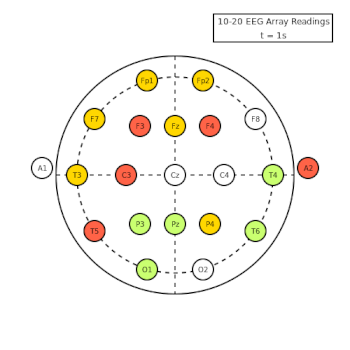
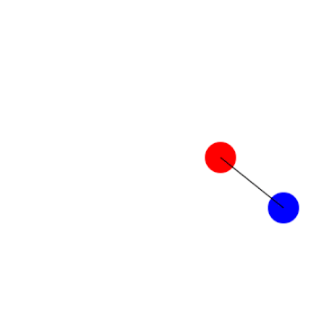
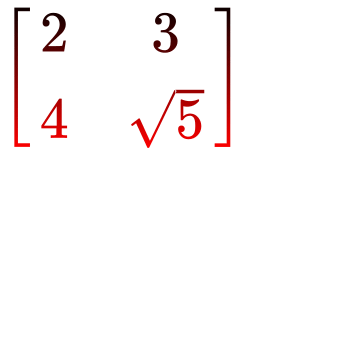

# Javis

[](https://github.com/invenia/BlueStyle)
[](https://Wikunia.github.io/Javis.jl/stable)
[](https://Wikunia.github.io/Javis.jl/dev)
[](https://github.com/Wikunia/Javis.jl/actions)
[](https://codecov.io/gh/Wikunia/Javis.jl)
[](https://julialang.zulipchat.com/#narrow/stream/253420-javis)


**Javis:** **J**ulia **A**nimations and **Vis**ualizations

## Introduction 

`Javis` makes generating simple animations a breeze!
Want to learn more?
Check out our [documentation](https://wikunia.github.io/Javis.jl/dev/) for tutorials, our contributing guidelines, and the mission of `Javis.jl`!

## Gallery

### Tutorials

| Animation                                                                                                     | Animation                                                                                                            |
|---------------------------------------------------------------------------------------------------------------|----------------------------------------------------------------------------------------------------------------------|
|                                                                                            |                                                                                       |
| **Tutorial:** [What Are Actions?](https://wikunia.github.io/Javis.jl/stable/tutorials/tutorial_2/)           | **Tutorial:** [Making Your First Javis Animation!](https://wikunia.github.io/Javis.jl/stable/tutorials/tutorial_1/) |
|                                                                                         |                                                                                                |
| **Tutorial:** [Taming the Elements](https://wikunia.github.io/Javis.jl/stable/tutorials/tutorial_5/)         | **Tutorial:** [Do You Know Our Mascot?](https://wikunia.github.io/Javis.jl/stable/tutorials/tutorial_4/)            |
|                                                                                         |                                                                                               |
| **Tutorial:** [Rendering LaTeX with Javis!](https://wikunia.github.io/Javis.jl/stable/tutorials/tutorial_3/) | **Tutorial:** [Using Animations.jl with Javis!](https://wikunia.github.io/Javis.jl/stable/tutorials/tutorial_6/)    |

### Examples

| Animation                                      | Animation
|------------------------------------------------|------------------------------------------------|
|       |                  |
| [Follow a Path](/examples/follow_path.jl)      |  [Draw the Julia Logo](/examples/fourier.jl) |

## Installation

To install `Javis` into your Julia installation, type into your Julia REPL the following:

```
julia> ] add Javis
```

That's all there is to it! 😃

### Optional Dependency

`Javis` supports `LaTeX` and currently we need this node dependency for it. We are looking forward to the time when everything can be handled by Julia.

```
npm install -g mathjax-node-cli
```

If you don't need `LaTeX`, there is no reason to install this :wink:

## State of development

`Javis.jl` is currently under heavy development but we wanted to bring you a first version after we received over 30 stars. It makes it easier to try out `Javis.jl` for you and we are looking forward to bug reports and issue requests. More the latter, but we expect things to fail!

### Current state

#### v0.2.0

`Javis` currently supports very simple animations with:
- `LaTeX` support
- Transformations
- Subactions
- Drawing grid lines
- Morphing one shape into another 
- Image Viewer (`; liveview=true`)
- Compatibility with [Animations.jl](https://github.com/jkrumbiegel/Animations.jl)

## Future goals

We have a list of issues for v0.3.0 and beyond which contain things like:
- Animating transposing a matrix using morphing [PR #175](https://github.com/Wikunia/Javis.jl/pull/175)
- Combine actions into layers/collections
- Polar coordinates
- Vectors
- ...

[Read more about the current state and our vision](https://opensourc.es/blog/javis-v0.2-and-future/)

Make sure to add a feature request if you think we miss something fundamental or something that would be nice to have.

## Acknowledgements

We want to thank a couple of people who helped make this possible.

### Core Inspirations

- First of all the over thousand contributors of Julia itself
- [Grant Sanderson of 3blue1brown](https://www.youtube.com/c/3blue1brown/featured) - thanks for inspiring us to create something like this in Julia! 
- [Cormullion](https://github.com/cormullion) the inventor of [Luxor.jl](https://github.com/JuliaGraphics/Luxor.jl)
- [JuliaGraphics in general](https://github.com/cormullion) who provide the wrapper [Cairo.jl](https://github.com/JuliaGraphics/Cairo.jl) for the [Cairo graphics library](https://www.cairographics.org/)

### Contributors 

- [@sudomaze](https://github.com/sudomaze) for helping out with tutorials and feedback for v0.1.0.
- [@mythreyiramesh](https://github.com/mythreyiramesh) helping with cleaning up tutorials 
- [@briochemc](https://github.com/briochemc) for spotting and cleaning up tutorial typos and grammar
- [@ric-cioffi](https://github.com/ric-cioffi) for adding the Julia Logo example and for feedback
- [@findmyway](https://github.com/findmyway) for fixing typos in documentation
- [@ArbitRandomUser](https://github.com/ArbitRandomUser) for cleaning up the LaTeX code base
