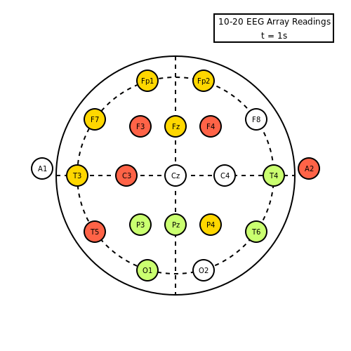

# Javis

[](https://github.com/invenia/BlueStyle)
[](https://Wikunia.github.io/Javis.jl/stable)
[](https://Wikunia.github.io/Javis.jl/dev)
[](https://github.com/Wikunia/Javis.jl/actions)
[](https://codecov.io/gh/Wikunia/Javis.jl)

**Javis:** **J**ulia **A**nimations and **Vis**ualizations

## Introduction 

**Javis:** makes generating simple animations a breeze.




## Installation

To install `Javis` into your Julia installation, type into your Julia REPL the following:

```
julia> ] add Javis
```

That's all there is to it! 😃

### Optional Dependency

Javis supports LaTeX and currently we need this node dependency for it. We are looking forward to the time when everything can be handled by Julia.

```
npm install -g mathjax-node-cli
```

If you don't need LaTeX there is no reason to install this :wink:

## State of development

Javis.jl is currently under heavy development but we wanted to bring you a first version after we received over 30 stars. It makes it easier to try out Javis.jl for you and we are looking forward to bug reports and issue requests. More the latter, but we expect things to fail!

## Tutorials 

If you want to dive into it directly make sure to check out our [documentation](https://Wikunia.github.io/Javis.jl/stable) which includes a bunch of tutorials and further information.

## Acknowledgements

I want to thank a couple of people who helped make this possible.

- First of all the over thousand contributors of Julia itself.
- [Cormullion](https://github.com/cormullion) the inventor of [Luxor.jl](https://github.com/JuliaGraphics/Luxor.jl)
- [JuliaGraphics in general](https://github.com/cormullion) who provide the wrapper [Cairo.jl](https://github.com/JuliaGraphics/Cairo.jl) for the [Cairo graphics library](https://www.cairographics.org/)
- [Jacob Zelko](https://github.com/TheCedarPrince) as the second main developer of this project
- [Sudomaze](https://github.com/sudomaze) for helping out with tutorials and feedback

## Current state

### v0.1.0

Javis currently supports very simple animations with:
- LaTeX support
- Transformations
- Subactions
- Drawing grid lines
- A tiny bit of morphing a shape into another 

## Future goals

We have a list of issues for v0.2.0 and beyond which contain things like:
- Animating transposing a matrix
- More morphing
- Combine actions into layers/collections
- Polar coordinates
- Vectors
- ...

Make sure to add a feature request if you think we miss something fundamental or something that would be nice to have.


