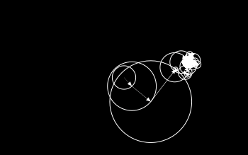

# Javis

[](https://github.com/invenia/BlueStyle)
[](https://Wikunia.github.io/Javis.jl/stable)
[](https://Wikunia.github.io/Javis.jl/dev)
[](https://github.com/Wikunia/Javis.jl/actions)
[](https://codecov.io/gh/Wikunia/Javis.jl)
[](https://julialang.zulipchat.com/#narrow/stream/253420-javis)

<!---->

**Javis:** **J**ulia **A**nimations and **Vis**ualizations

## Introduction 

`Javis` makes generating simple animations a breeze!
Want to learn more?
Check out our [documentation](https://wikunia.github.io/Javis.jl/dev/) for tutorials, our contributing guidelines, and the mission of `Javis.jl`!

## Join Our Developer Community!

We have a live Zulip stream that you can join to discuss Javis with other Javis users!
We'd love to have you and hear your thoughts and see what you are making!

Click this badge to join: [](https://julialang.zulipchat.com/#narrow/stream/253420-javis)

## Gallery

### Tutorials

| Animation                                                                                                     | Animation                                                                                                            |
|---------------------------------------------------------------------------------------------------------------|----------------------------------------------------------------------------------------------------------------------|
|                                                                                            |                                                                                       |
| **Tutorial:** [What Are Actions?](https://wikunia.github.io/Javis.jl/stable/tutorials/tutorial_2/)           | **Tutorial:** [Making Your First Javis Animation!](https://wikunia.github.io/Javis.jl/stable/tutorials/tutorial_1/) |
|                                                                                         |                                                                                                |
| **Tutorial:** [Taming the Elements](https://wikunia.github.io/Javis.jl/stable/tutorials/tutorial_5/)         | **Tutorial:** [Do You Know Our Mascot?](https://wikunia.github.io/Javis.jl/stable/tutorials/tutorial_4/)            |
|                                                                                         |                                                                                               |
| **Tutorial:** [Rendering LaTeX with Javis!](https://wikunia.github.io/Javis.jl/stable/tutorials/tutorial_3/) | **Tutorial:** [Using Animations.jl with Javis!](https://wikunia.github.io/Javis.jl/stable/tutorials/tutorial_6/)    |

### Examples

| Animation                                      | Animation
|------------------------------------------------|------------------------------------------------|
|       |                  |
| [Follow a Path](/examples/follow_path.jl)      |  [Draw the Julia Logo](/examples/fourier.jl) |

## Design Philosophy

Although `Javis.jl` is constantly being improved and made better, our design philosophy remains largely the same with only few changes happening to it.
We use Object-Action paradigm for creating visualizations.
Furthermore, details on our philosophy can be found here: [Design Mission and Philosophy](https://wikunia.github.io/Javis.jl/stable/mission/)

## Installation

To install `Javis` into your Julia installation, type into your Julia REPL the following:

```
julia> ] add Javis
```

That's all there is to it! 😃

### Optional Dependency

`Javis` supports `LaTeX` and currently we need this node dependency for it. We are looking forward to the time when everything can be handled by Julia.

```
npm install -g mathjax-node-cli
```

If you don't need `LaTeX`, there is no reason to install this :wink:

## Acknowledgements

We want to thank a couple of people who helped make this possible.

### Core Inspirations

- First of all the over thousand contributors of Julia itself
- [Grant Sanderson of 3blue1brown](https://www.youtube.com/c/3blue1brown/featured) - thanks for inspiring us to create something like this in Julia! 
- [Cormullion](https://github.com/cormullion) the inventor of [Luxor.jl](https://github.com/JuliaGraphics/Luxor.jl)
- [JuliaGraphics in general](https://github.com/cormullion) who provide the wrapper [Cairo.jl](https://github.com/JuliaGraphics/Cairo.jl) for the [Cairo graphics library](https://www.cairographics.org/)

### Contributors 

- [@Sov-trotter](https://github.com/Sov-trotter) for implementing the Jupyter and Pluto viewer tools, streaming and layers
- [@sudomaze](https://github.com/sudomaze) for helping out with tutorials and feedback for v0.1.0
- [@mythreyiramesh](https://github.com/mythreyiramesh) helping with cleaning up tutorials 
- [@briochemc](https://github.com/briochemc) for spotting and cleaning up tutorial typos and grammar
- [@ric-cioffi](https://github.com/ric-cioffi) for adding the Julia Logo example and for feedback
- [@findmyway](https://github.com/findmyway) for fixing typos in documentation
- [@ArbitRandomUser](https://github.com/ArbitRandomUser) for cleaning up the LaTeX code base
- [@agerlach](https://github.com/agerlach) for improving the internal LaTeX parsing
- [@matbesancon](https://github.com/matbesancon) for adding in an example on projections and for identifying an issue with Javis image processing
- [@codejaeger](https://github.com/codejaeger) - for improving the Javis viewer tool
- [@XRFXLP](https://github.com/XRFXLP) - fixing typo in docs
- [@Ved-Mahajan](https://github.com/Ved-Mahajan) - for adding an example on Earth Venus cosmic dance
- [@rmsrosa](https://github.com/rmsrosa) - for adding an example on escaping the swirling vortex
- [@EnzioKam](https://github.com/EnzioKam) - for adding an example on the Galton Board
- [@gpucce](https://github.com/gpucce) - for adding an example on the Central Limit Theorem
- [@pitmonticone](https://github.com/pitmonticone) - finding a typo in the docs
