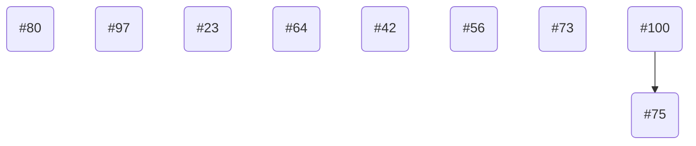

# v0.2.0 To-Do's

## Improve Speed of `Javis`

- [ ] 102	OPEN	Ability to see animation live without creating pngs	enhancement	2020-08-18 16:46:49 +0000 UTC

- [x] 101	OPEN	Generate mp4	enhancement	2020-08-18 16:46:14 +0000 UTC

- [ ] 55	OPEN	Usage of VideoIO		2020-08-12 16:50:28 +0000 UTC

## Determining How to Relate Objects to Background

---

- [X] 103	OPEN	Transformation: Scale	enhancement	2020-08-18 16:54:28 +0000 UTC

- [ ] 98	OPEN	Hijack Plotting Library for Object Positioning	enhancement, question	2020-08-17 19:32:37 +0000 UTC

- [ ] 31	OPEN	Vectors	enhancement	2020-08-05 13:53:18 +0000 UTC

- [ ] 40	OPEN [WIP] Vector Animations	tcp-feature-31	DRAFT

- [ ] 38	OPEN	Improving Grid Line Animations	Low Priority, enhancement, good first issue	2020-08-17 19:34:33 +0000 UTC

## Addressing `Javis` Overall Functionality

- [ ] 100	OPEN	Use @Action instead of Action	enhancement	2020-08-18 17:01:07 +0000 UTC

- [ ] 97	OPEN	Animation persist after completion	enhancement	2020-08-18 17:00:50 +0000 UTC

- [ ] 80	OPEN	Morphing v2 with color and fill :)	enhancement	2020-08-18 16:43:05 +0000 UTC

- [ ] 75	OPEN	combine actions in a layer	enhancement, question	2020-08-13 13:48:14 +0000 UTC

- [x] 73	OPEN	Simpler code for using different forms of frames		2020-08-18 16:51:33 +0000 UTC

- [ ] 64	OPEN	Javis Templates	Low Priority, To the Moon!, documentation, …	2020-08-09 18:31:06 +0000 UTC

- [ ] 56	OPEN	ProgressMeter	enhancement	2020-08-09 22:21:42 +0000 UTC

- [ ] 42	OPEN	Using Animations.jl	enhancement, question	2020-08-05 13:42:17 +0000 UTC

- [x] 23	OPEN	fontsize and color in Javis instead of Luxor	enhancement, question	2020-08-18 14:59:14 +0000 UTC

<!--stackedit_data:
eyJoaXN0b3J5IjpbLTEyNjM1MTc0MTZdfQ==
-->
