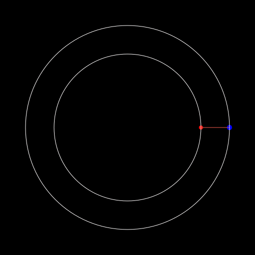

## Examples

Aside from tutorials which take you step by step on how to create a tutorial, we also felt that it useful to show additional examples on things you can make with `Javis`!
These animations do not have an accompanying tutorial but rather, scripts that you can examine, tweak, and modify to suit your own purposes.
If you have an interesting example that you would like to share with us, open an issue (check out our [Contributing Guide](contributing.md) on how to do this) and we'd be happy to add your example to this page!

| Example                            | Link                                                                                               | Details                                                                                                                                                                                                                    |
|------------------------------------|----------------------------------------------------------------------------------------------------------------------------------------------------------------------------------------|-----------------------------------------------------------------------------------------------------------------------------------------------------------------------------------------------------------------------------------------------------------------------------------------------------------------|
|  | [Follow a Path](https://github.com/Wikunia/Javis.jl/blob/master/examples/follow_path.jl) | This creates a bezier curve to draw the outline of a car and have a circle go around that outlined path. [`follow_path`](@ref), `makebezierpath`, and [`appear`](@ref) were used to create this animation. |
|  | [Draw the Julia Logo](https://github.com/Wikunia/Javis.jl/blob/master/examples/fourier.jl) | Drawing the Julia logo using Fourier series approximation. It uses the libraries FFTW, FFTViews and TravelingSalesmanHeuristics. Inspired by [ric-cioffi](https://github.com/ric-cioffi) |
|  | [Project a rotating point](https://github.com/Wikunia/Javis.jl/blob/master/examples/projection.jl) | Creates a rotating point and its projection on the positive orthant. Inspired by [matbesancon](https://github.com/matbesancon) |
|  | [Earth Venus Cosmic Dance](https://github.com/Wikunia/Javis.jl/blob/master/examples/cosmic_dance.jl) | This creates a beautiful animation of the cosmic dance of Earth and Venus giving rise to the 5 petals. Contributed by [Ved Mahajan](https://github.com/Ved-Mahajan)
|  | [Escaping the swirling vortex](https://github.com/Wikunia/Javis.jl/blob/master/examples/escaping_the_swirling_vortex.jl) | This shows the vector field of a nonautonomous ODE for which the eigenvalues of the jacobian have negative real part but the origin is unstable, so the nonstationary solutions "escape the swirling vortex". The system of ODEs is credited to L. Markus and H. Yamabe (1960). Contributed by [Ricardo M. S. Rosa](https://github.com/rmsrosa) |
