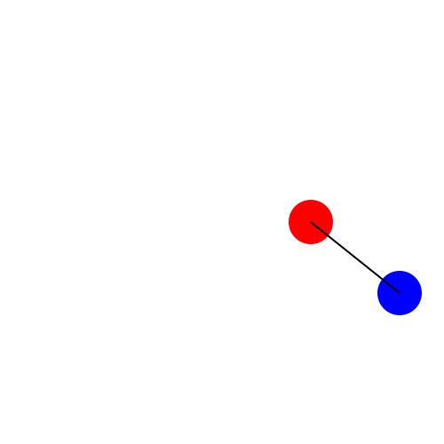

# **Tutorial 8:** Fun with Layers! An Intro to `@JLayer`

So far, we have been using `Javis` to create one animation at a time.
This has been great and you should be proud of your `Javis` skills so far!
However, what if I told you, there is a way to make multiple animations in one animation? 😎

And the way to do that?
Layers - specifically, `@JLayer`'s!

## What Even Are Layers? And What's a `@Jlayer`?

_Explain what layers are.
Then move to explain what JLayer's are._

## Going Back to the Basics

In [Tutorial 1](tutorial_1.md), you learned how to make circles go around



For this tutorial, we are going to reuse this animation but create an artistic animation similar to the works of famous American pop artist, Andy Warhol - here is an example:

http://www.mrspicassosartroom.com/2012/05/andy-warhol-color-theory-animals.html

### Let's Add Some Color!

First let us adjust the dancing circles animation to allow for color tweaking

```julia
using Javis

function ground(args...)
    background("white") # canvas background
    sethue("black") # pen color
end

function object(p=O, color="black")
    sethue(color)
    circle(p, 25, :fill)
    return p
end

function path!(points, pos, color)
    sethue(color)
    push!(points, pos) # add pos to points
    circle.(points, 2, :fill) # draws a circle for each point using broadcasting
end

function connector(p1, p2, color)
    sethue(color)
    line(p1,p2, :stroke)
end

function dancing_circles(start_pos, c1, c2)
    path_of_red = Point[]
    path_of_blue = Point[]

    red_ball = Object((args...)->object(O, c1), start_pos + (100, 0))
    act!(red_ball, Action(anim_rotate_around(2π, start_pos)))
    blue_ball = Object((args...)->object(O, c2), start_pos + (200, 80))
    act!(blue_ball, Action(anim_rotate_around(2π, 0.0, red_ball)))
    Object((args...)->path!(path_of_red, pos(red_ball), c1))
    Object((args...)->path!(path_of_blue, pos(blue_ball), c2))
end
```

Now we have all the ingredients for a colored animation where we switched the color of the moving circles.

```julia
colored_planets = Video(500, 500)

Background(1:70, ground)

dancing_circles(O, "yellow", "green")

render(colored_planets, pathname="colored_planets.gif")

finalvideo = Video(500, 500)

Background(1:140, ground)
```
This will result in the following 


### Moving Our Animation with Layers

We can now use layers to move around out previous animation. First we wrap it in a `@JLayer` macro.

```julia
myvideo = Video(500, 500)

Background(1:70, ground)

l1 = @JLayer 1:70 begin
    dancing_circles("green", "orange", Point(100, 0))
end
```
Then we `act!` on it as if it was a regular Object.

```julia
act!(l1, Action(1:1, anim_scale(0.4)))
act!(l1, Action(1:140, anim_translate(Point(150, 150)), keep=true))

render(myvideo; pathname="tutorial_1.gif")
```

All together this lets you move the older animation around the video withour any effort!!


## Organizing Our Creation

### Positioning Our Layers

_Show where we are going to put layers and how they are organized in the four corners)_


```julia
colors = [
    ["red", "green"],
    ["orange", "blue"],
    ["yellow", "purple"],
    ["greenyellow", "darkgoldenrod1"]
]

final_points = [
    Point(-150, -150),
    Point(150, -150),
    Point(150, 150),
    Point(-150, 150),
]

planets = map(colors) do c
    @JLayer 1:140 begin
        dancing_circles(O, c...) 
    end
end

anim_back_and_forth = map(final_points) do point
    Animation(
        [0.0, 1/2, 1.0],
        [O, point, O],
        [sineio(), sineio()]
    )
end

map(zip(anim_back_and_forth, planets)) do ((animation, pl))
    act!(pl, Action(1:1, anim_scale(0.4)))
    act!(pl, Action(1:140, animation, translate(), keep=true))
end

map(zip(anim_back_and_forth, planets)) do (animation, pl)
    act!(pl, Action(1:1, anim_scale(0.4)))
    act!(pl, Action(1:140, animation, translate()))
end

```
### They're Multiplying!


_Create all four animations and move them to their appropriate locations.
Finish up the tutorial here_

## Conclusion

_Recap what was learned here._

## Full Code

_Add the full code snippet for the animation_

```julia
using Javis
using Animations

function ground(args...)
    background("black") # canvas background
    sethue("white") # pen color
end

function object(p=O, color="black")
    sethue(color)
    circle(p, 25, :fill)
    return p
end

function path!(points, pos, color)
    sethue(color)
    push!(points, pos) # add pos to points
    circle.(points, 2, :fill) # draws a circle for each point using broadcasting
end

function dancing_circles(start_pos, c1, c2)
    path_of_red = Point[]
    path_of_blue = Point[]

    red_ball = Object((args...)->object(O, c1), start_pos + (100, 0))
    act!(red_ball, Action(anim_rotate_around(2π, start_pos)))
    blue_ball = Object((args...)->object(O, c2), start_pos + (200, 80))
    act!(blue_ball, Action(anim_rotate_around(2π, 0.0, red_ball)))
    Object((args...)->path!(path_of_red, pos(red_ball), c1))
    Object((args...)->path!(path_of_blue, pos(blue_ball), c2))
end

finalvideo = Video(500, 500)

Background(1:140, ground)

colors = [
    ["red", "green"],
    ["orange", "blue"],
    ["yellow", "purple"],
    ["greenyellow", "darkgoldenrod1"]
]

final_points = [
    Point(-150, -150),
    Point(150, -150),
    Point(150, 150),
    Point(-150, 150),
]

planets = map(colors) do c
    @JLayer 1:140 begin
        dancing_circles(O, c...) 
    end
end

anim_back_and_forth = map(final_points) do point
    Animation(
        [0.0, 1/2, 1.0],
        [O, point, O],
        [sineio(), sineio()]
    )
end

map(zip(anim_back_and_forth, planets)) do (animation, pl)
    act!(pl, Action(1:1, anim_scale(0.4)))
    act!(pl, Action(1:140, animation, translate()))
end

render(finalvideo; pathname="docs/src/tutorials/assets/4_moving_colored_dancing_circles.gif")

```

## Misc To-Dos

- [ ] Change name of file to tutorial_X.md when done
- [ ] Add link to tutorial on "Beginners Start Here Page"
- [ ] Add link to Documenter make.jl