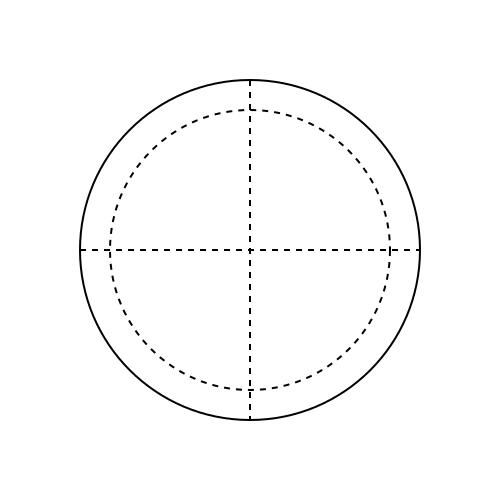
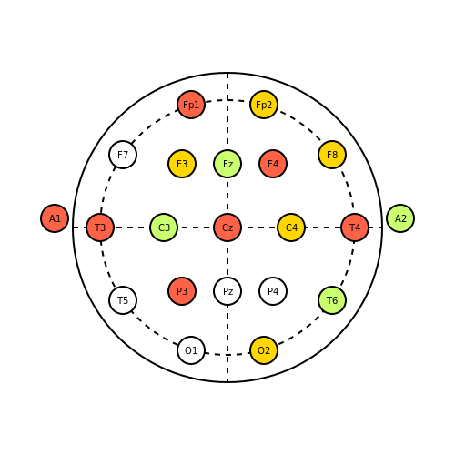

# **Project 1:** Animating a Brain!

In this tutorial, we are going to learn how to make a brain! 🧠 
Well, not _exactly_ making a brain. 
Instead, we are going to animate brain activity by simulating a [10-20 EEG Electrode Array](https://en.wikipedia.org/wiki/10%E2%80%9320_system_(EEG)?oldformat=true) using random data. 
This Project Tutorial builds on prior tutorials and serves as a cumulative test of your understanding about `Javis`.

When you are done with this tutorial, you will have created the following animation:


# Learning Outcomes

From this project tutorial you will:

- Clearly understand how each component of `Javis` is used to create an animation
- Be able to create more complex animations
- Display meaningful information on your animations

# Setting Up Our Animation

As demonstrated in prior tutorials, we will use `Javis` to create a `Video` object:

```julia
using Javis

video = Video(500, 500)
```

Let's define our background function to create the backdrop of our frames:

```julia
function ground(args...)
    background("white")
    sethue("black")
end
```

If we were to execute the `javis` command now, this is what would appear as an output of the following execution:

```julia
video = Video(500, 500)
javis = javis(video, [Action(1:30, ground)], pathname = "eeg.gif", framerate = 1)
```


As you can see, we have generated a blank gif.
Not exactly what we want but it is a start!

> **NOTE:** For this animation, we will be using a framerate of 1 frame per second.
> Thus, why `framerate` is set to the value of 1.

# Getting _Ahead_

Now that we have our layers set-up, let's move onto actually making the head that we will attach our electrodes to!

First, we define an additional function that allows us to draw a circle.
This will be used extensively later also:

```julia
function circ(p = O, color = "black", action = :fill, radius = 25, edge = "solid")
    sethue(color)
    setdash(edge)
    circle(p, radius, action)
    return Transformation(p, 0.0)
end
```

Placing this inside of the `javis` function, we can draw our head:

```julia
...
    Action(:same, :head, (args...) -> circ(O, "black", :stroke, 170)),
...
```


Now we are getting _ahead_!

> **NOTE:** The ellipses, `...`, in the code block to produce the head represents putting the action inside of the `javis` function.
> If you are confused about what I mean, please refer to a prior tutorial or the docstring of `javis` in your Julia REPL. 😄

# Placing the Electrodes

To draw our electrodes, it would be useful to have a frame of reference for where the electrodes are supposed to go.
Let's draw some axes for our electrode locations!

We will need to define a new function that allows us to draw lines.
This is accomplished by the following function definition:

```julia
function draw_line(p1 = O, p2 = O, color = "black", action = :stroke, edge = "solid")
    sethue(color)
    setdash(edge)
    line(p1, p2, action)
end
```

Now, we can add in some grid lines for our electrode array. 
The following code places a vertical and horizontal axis as well as an inscribed circle to represent polar placement of the electrodes:

```julia
...
        Action(
            :same,
            :inside_circle,
            (args...) -> circ(O, "black", :stroke, 140, "longdashed"),
        ),
        Action(
            :same,
            :vert_line,
            (args...) ->
                draw_line(Point(0, -170), Point(0, 170), "black", :stroke, "longdashed"),
        ),
        Action(
            :same,
            :horiz_line,
            (args...) ->
                draw_line(Point(-170, 0), Point(170, 0), "black", :stroke, "longdashed"),
...
```



Great!
Now that we have the gridlines, let's add in our nodes!
As `javis` has no native support for making circles which hold text, we have to define our own function.
This is not hard to do and requires drawing two circles per electrodes to be "on top of" the grid lines:

```julia
function outline_circ(
    p = O,
    fill_color = "white",
    outline_color = "black",
    action = :fill,
    radius = 25,
    circ_text = "",
)
    sethue(fill_color)
    circle(p, radius, :fill)
    sethue(outline_color)
    circle(p, radius, :stroke)
    text(circ_text, p, valign = :middle, halign = :center)
end
```

Using `outline_circ` function, the following code block creates each electrode at its proper location.
Feel free to just copy and paste this code below as it took some time to position the electrodes properly (the writer knows this all too well...):

```julia
...
        Action(
            :same,
            :cz,
            (args...) -> outline_circ(O, "white", "black", :fill, radius, "Cz"),
        ),
        Action(
            :same,
            :c3,
            (args...) ->
                outline_circ(Point(-70, 0), "white", "black", :fill, radius, "C3"),
        ),
        Action(
            :same,
            :c4,
            (args...) ->
                outline_circ(Point(70, 0), "white", "black", :fill, radius, "C4"),
        ),
        Action(
            :same,
            :t3,
            (args...) -> outline_circ(
                Point(-140, 0),
                "white",
                "black",
                :fill,
                radius,
                "T3",
            ),
        ),
        Action(
            :same,
            :t4,
            (args...) ->
                outline_circ(Point(140, 0), "white", "black", :fill, radius, "T4"),
        ),
        Action(
            :same,
            :pz,
            (args...) ->
                outline_circ(Point(0, 70), "white", "black", :fill, radius, "Pz"),
        ),
        Action(
            :same,
            :p3,
            (args...) -> outline_circ(
                Point(-50, 70),
                "white",
                "black",
                :fill,
                radius,
                "P3",
            ),
        ),
        Action(
            :same,
            :p4,
            (args...) ->
                outline_circ(Point(50, 70), "white", "black", :fill, radius, "P4"),
        ),
        Action(
            :same,
            :fz,
            (args...) ->
                outline_circ(Point(0, -70), "white", "black", :fill, radius, "Fz"),
        ),
        Action(
            :same,
            :f3,
            (args...) -> outline_circ(
                Point(-50, -70),
                "white",
                "black",
                :fill,
                radius,
                "F3",
            ),
        ),
        Action(
            :same,
            :f4,
            (args...) -> outline_circ(
                Point(50, -70),
                "white",
                "black",
                :fill,
                radius,
                "F4",
            ),
        ),
        Action(
            :same,
            :f8,
            (args...) -> outline_circ(
                Point(115, -80),
                "white",
                "black",
                :fill,
                radius,
                "F8",
            ),
        ),
        Action(
            :same,
            :f7,
            (args...) -> outline_circ(
                Point(-115, -80),
                "white",
                "black",
                :fill,
                radius,
                "F7",
            ),
        ),
        Action(
            :same,
            :t6,
            (args...) -> outline_circ(
                Point(115, 80),
                "white",
                "black",
                :fill,
                radius,
                "T6",
            ),
        ),
        Action(
            :same,
            :t5,
            (args...) -> outline_circ(
                Point(-115, 80),
                "white",
                "black",
                :fill,
                radius,
                "T5",
            ),
        ),
        Action(
            :same,
            :fp2,
            (args...) -> outline_circ(
                Point(40, -135),
                "white",
                "black",
                :fill,
                radius,
                "Fp2",
            ),
        ),
        Action(
            :same,
            :fp1,
            (args...) -> outline_circ(
                Point(-40, -135),
                "white",
                "black",
                :fill,
                radius,
                "Fp1",
            ),
        ),
        Action(
            :same,
            :a1,
            (args...) -> outline_circ(
                Point(-190, -10),
                "white",
                "black",
                :fill,
                radius,
                "A1",
            ),
        ),
        Action(
            :same,
            :a2,
            (args...) -> outline_circ(
                Point(190, -10),
                "white",
                "black",
                :fill,
                radius,
                "A2",
            ),
        ),
        Action(
            :same,
            :o1,
            (args...) -> outline_circ(
                Point(-40, 135),
                "white",
                "black",
                :fill,
                radius,
                "O1",
            ),
        ),
        Action(
            :same,
            :o2,
            (args...) -> outline_circ(
                Point(40, 135),
                "white",
                "black",
                :fill,
                radius,
                "O2",
            ),
        ),
...
```

Now, executing this code block with our previously defined functions, we get this output:


# "If Only I Had a Brain..." 🎵

I think this is starting to come together quite nicely!
It would appear that our subject however has no brain activity - quite alarming! 😱
Like the scarecrow from the film, _The Wizard of Oz_, let's give him a brain!

To simulate brain activity, we are going to add one more package from Julia base.
This package is the `Random` package and it needs to be added like such:

```julia
using Javis
using Random
```

From there, we need to define colors to represent no, low, medium, and high brain activity.
Feel free to change up the colors!
I chose these colors that need to be added to your code:

```julia
indicators = ["tomato", "darkolivegreen1", "gold1", "white"]
```

From there, we also need to change the code block that defined the electrode locations.
The previous electrode code looked like this

```julia
...
        Action(
            :same,
            :cz,
	    (args...) -> outline_circ(O, "white" ,"black", :fill, radius, "Cz"),
        ),
...
```

However, what we now need to change is `"white"` to `rand(indicators)` for each electrode.
An example resulting electrode would look like this:

```julia
...
        Action(
            :same,
            :cz,
            (args...) -> outline_circ(O, rand(indicators), "black", :fill, radius, "Cz"),
        ),
...
```

Once all these modifications were made, execute your eeg code and you should get something that looks like this:



IT'S ALIVE!!! 🔬
We could finish this now, but let's add just a little bit more polish to it.

# As You Can See Here...

Let's add some information to our animation. 
We can create an info box using the following function:

```julia
function info_box(video, action, frame)
    fontsize(12)
    box(140, -210, 170, 40, :stroke)
    text("10-20 EEG Array Readings", 140, -220, valign = :middle, halign = :center)
    text("t = $(frame)s", 140, -200, valign = :middle, halign = :center)
end
```

It's invocation in the code looks like this:

```julia
...
Action(:same, :info, info_box),
...
```

> **NOTE:** The function for `info_box` is a little different.
> If you are confused, please look at [Tutorial 2](/tutorials/tutorial_2.html)

Once everything is executed, we get this very nice and clean looking animation which shows what this animation is and when parts of the brain are activated:


# Conclusion

Congratulations! 🎉🎉🎉
You just finished your first project tutorial and we at `Javis` are super proud!
To recap, by working through this animation you should now:

1. Clearly understand how each component of Javis is used to create an animation
2. See how to create complex animations
3. Know how to display meaningful information on your animations

Have fun with `Javis` and I encourage you to continue worth future tutorials to make even better animations and improve your `Javis` skills.
Good luck! 

---
---

> **Author(s):** Jacob Zelko, Ole Kröger \
> **Date:** August 11th, 2020 \
> **Tag(s):** brain, eeg, project, tutorial, electrodes

