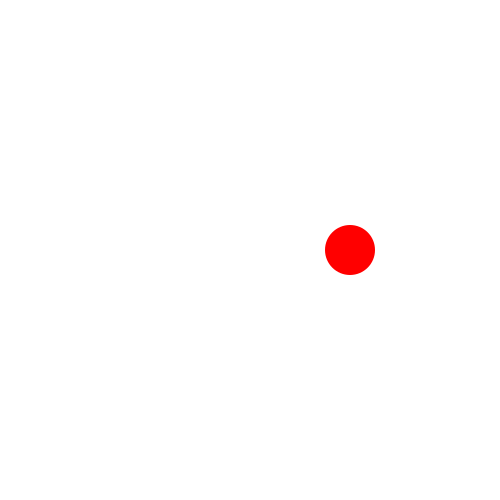
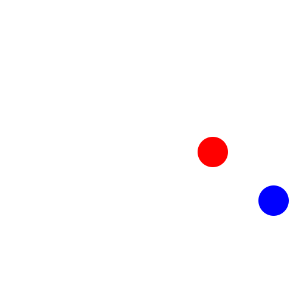
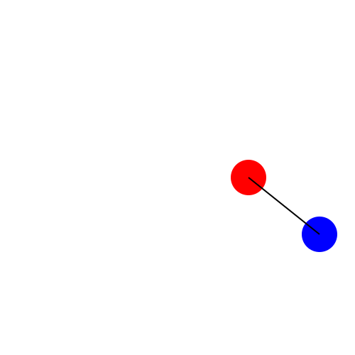

# **Tutorial 1:** Making Your First Javis Animation!

## Introduction

If you are reading this tutorial, I am going to assume this is the first time you are using `Javis` to create an animation. 
In that case, welcome to `Javis`! 😃 
By following this tutorial, we are going to make you a director of your very own animations written in pure Julia! 🎬 🎥

If you have not installed `Javis` yet, please visit the homepage to [read the installation instructions](../index.md#Installing-Javis.jl).

## Learning Outcomes

In this tutorial you'll learn:

- What `Javis.jl` is.
- How to make a basic animation using `Action` objects.
- Move objects created by `Javis`.
- Elements of `Luxor.jl`.

By the end of this tutorial, you will have made the following animation:


With all that said, let's dive in to this tutorial! ✨

## So... What Is `Javis.jl`?

`Javis.jl` is an abstraction on top of powerful graphics tools to make animations and visualizations easy to create.
It is built on top of the fantastic Julia drawing packages, [`Luxor.jl`](https://github.com/JuliaGraphics/Luxor.jl) and [`Cairo.jl`](https://github.com/JuliaGraphics/Cairo.jl).
`Cairo.jl` is much too complex to explain here, but `Luxor.jl` gives one the ability to define and draw on a canvas.
`Luxor.jl` provides simple functions like `line`, `circle` and `Draw` by which one can make animations. 

> **NOTE:** If you're interested in 2D graphics, you should definitely check out the awesome `Luxor.jl` package.
> It has a [great tutorial](https://juliagraphics.github.io/Luxor.jl/stable/tutorial/) that will give you an even greater understanding of how `Javis.jl` works.

## The `javis` Function - the Heart of `Javis.jl`

In order to use `Javis`, we will start with the following import:

```julia
using Javis
```

Then, we will introduce our first and most import function from `Javis` - the `javis` function:

```
javis(
    video = [[video]], 
    actions = [[actions]], 
    pathname = [[pathname]]
)
```

The `javis` function has three key word parameters that the user must define in order to create an animation:

- `video` - a `Video` struct
- `actions` - a vector of `Action` objects
- `pathname` - a `String` 

These kwargs are further explained in the following sections. 

### `video`

The `video` argument requires a `Video` struct.
This `Video` struct creates the canvas upon which we will draw. 🎨 
To create a `Video` object, one defines the constructor with a width and height:

```julia
myvideo = Video(500,500) # 500 x 500 // width x height
```

### `actions`

Core to not only the `javis` function but the entire `Javis.jl` library are `Action` objects. 
`Action` objects will be better explained in [Tutorial 2](tutorial_2.md).
For now, just know that an `Action` object is what draws shapes or moves shapes on a `Video`.
In the `javis` function, `actions` is a vector of `Action` objects.

### `pathname`

The `pathname` is a `String` that defines where to put the output animation on your computer.
In the `pathname`, you must end the path with the name of the animation and its associated filetype extension.
Here is an example invocation of the `javis` function with a provided path name:

```julia
javis(
    myvideo, 
    myactions, 
    pathname = "/home/myanimation.gif"
)
```

## Making Our Animation

We need to set-up a few functions that will be able to make our animation! 

Our first function is the `ground` function.
The `ground` function sets the background to white and the "pen" color to black:

```julia
function ground(args...) 
    background("white") # canvas background
    sethue("black") # pen color
end
```

> **NOTE:** One may wonder, "why is `args...` needed in the `ground` function?"
> To explain, each user-defined function gets three arguments `video`, `action`, and `frame` provided by `javis`
> These arguments are defined below:
>
> - `video`: Video struct
> - `action`: Action struct
> - `frame`: the current frame number
>
> Although these arguments are irrelevant for the `ground` function, we need to write `args...` such that Julia actually knows that we have a method that accepts those three arguments.
> The `...` basically stands for as many arguments as you want.

Although `Luxor.jl` provides the functionality to draw circles,  `Javis` does not. 
We use `Luxor.jl` to create a function that defines a color for circles and draws the circles accordingly.
Here is how that code looks:

```julia
function object(p=O, color="black")
    sethue(color)
    circle(p, 25, :fill)
    return p
end
```

## Let's Draw a Circle!

Using our newly found `Javis` knowledge, we can now draw a circle!
We do the following after importing the `Javis.jl` package and defining our own functions (don't worry if you don't understand the syntax here - it is too advanced for this tutorial but will be explained in future tutorials):


```julia
myvideo = Video(500, 500)
javis(
    myvideo,  
    [
        BackgroundAction(1:70, ground),
        Action(1:70, :red_ball, (args...) -> object(Point(100,0), "red")),
    ],
    pathname="circle.gif"
)
```



You did it! 🎉 You created your first drawing with `Javis`! 🔴

Let's go crazy and draw another one:

```julia
javis(
    myvideo,  
    [
        BackgroundAction(1:70, ground),
        Action(1:70,:red_ball, (args...)->object(Point(100,0), "red")),
	Action(1:70, :blue_ball, (args...)->object(Point(100,80), "blue"))
    ],
    pathname="multiple_circles.gif"
)
```


So, this drawing - it's all nice and all, but perhaps a little...
Dull? 
This is supposed to be an animation!
Let's make these balls dance. 💃

## It Takes Two to Tango 💃

Let's use the special modifier, `Rotation`, to produce a ball that rotates in a circle:

```julia
javis(
    myvideo,  
    [
        BackgroundAction(1:70, ground),
        Action(1:70,:red_ball, (args...)->object(Point(100,0), "red"), Rotation(0.0, 2π)),
    ],
    pathname="rotation.gif"
)
```


Now that's what I call dancing!
However, I think our red ball is a bit lonely, don't you think?
It needs a partner!

To make another ball appear, execute the following code snippet:

```julia
javis(
    myvideo,  
    [
        BackgroundAction(1:70, ground),
        Action(1:70,:red_ball, (args...)->object(Point(100,0), "red"), Rotation(0.0, 2π)),
        Action(1:70, :blue_ball, (args...)-> object(Point(100,80), "blue"), Rotation(2π, 0.0, :red_ball))
    ],
    pathname="dynamic_rotation.gif"
)
```



There we go! 

## Mapping an Orbit 🚀

Now, imagine we are astronomers and we model these balls as planets.
It would be important to know their orbital trajectories!
To do so, let's draw the path that both of the balls take with this new function:

```julia
function path!(points, pos, color)
    sethue(color)
    push!(points, pos) # add pos to points
    circle.(points, 2, :fill) # draws a circle for each point using broadcasting
end
```

> **NOTE:** The [`pos`](@ref) takes the **pos**ition of the `:red_ball` and passes it as an argument into the `path!` function. 

Then, using this function, we can execute the following block:

```julia
path_of_red = Point[]

javis(
    myvideo,  
    [
        BackgroundAction(1:70, ground), 
        Action(1:70,:red_ball, (args...)->object(Point(100,0), "red"), Rotation(0.0, 2π)), 
        Action(1:70, (args...)->path!(path_of_red, pos(:red_ball), "red"))
    ],
    pathname="dotted_points.gif" # path with output file name
)
```


Fantastic!
That's a pretty regular orbit I must say!

Now, to easily visualize our two "planets" (the red and blue balls), let's connect them together. 
We can do so by drawing a line that connects both balls:

```julia
function connector(p1, p2, color)
    sethue(color)
    line(p1,p2, :stroke)
end
```

And to show this link:

```julia
javis(
    myvideo,  
    [
        BackgroundAction(1:70, ground),
        Action(1:70,:red_ball, (args...)->object(Point(100,0), "red"), Rotation(0.0, 2π)), 
        Action(1:70, :blue_ball, (args...)->object(Point(100,80), "blue"), Rotation(2π, 0.0, :red_ball)), 
        Action(1:70, (args...)->connector(pos(:red_ball), pos(:blue_ball), "black"))
    ],
    pathname="connect_two_points.gif" # path with output file name
)
```



Perfect! Now, let's put everything together to see our orbiting planets' trajectories:

```julia
using Javis

# applied on every frame
function ground(args...)
    background("white") # canvas background
    sethue("black") # pen color
end

# draw a circle
function object(p=O, color="black")
    sethue(color)
    circle(p, 25, :fill)
    return p
end

# draw dotted points
function path!(points, pos, color)
    sethue(color)
    push!(points, pos)
    circle.(points, 2, :fill)
end

# draw a line to connect two points
function connector(p1, p2, color)
    sethue(color)
    line(p1,p2, :stroke)
end

# center for the two objects
p1 = Point(100,0)
p2 = Point(100,80)

# dotted points vectors
path_of_blue = Point[]
path_of_red = Point[]

# video struct (width, height)
myvideo = Video(500, 500)

javis(
    myvideo,  
    [
        BackgroundAction(1:70, ground), # set background color and pen color
        Action(1:70,:red_ball, (args...)->object(p1, "red"), Rotation(0.0, 2π)), # draw the red ball with rotation
        Action(1:70, :blue_ball, (args...)-> object(p2, "blue"), Rotation(2π, 0.0, :red_ball)), # draw the blue ball with dynamic rotation
        Action(1:70, (args...)->path!(path_of_red, pos(:red_ball), "red")), # draw tracks for red ball
        Action(1:70, (args...)->path!(path_of_blue, pos(:blue_ball), "blue")), # draw track for blue ball
        Action(1:70, (args...)->connector(pos(:red_ball), pos(:blue_ball), "black")) # draw a line that connects both balls
    ],
    pathname="dancing_circles.gif" # path with output file name
)
```


Do you see any little green men on these planets? 👽 

## Conclusion

Amazing!!!
You have just made your first animation using `Javis.jl` and we are so proud!
I hope you feel like you accomplished something!

To recap, by working through this animation you should now:

1. Know how to make a simple animation in Javis
2. Understand the difference between `Action` and `BackgroundAction`
3. Be able to connect actions together using variable syntax

If you want to know more and experiment with `Javis`, go onto the following tutorials!
We wish you best on your `Javis` journey!

> **Author(s):** @sudomaze, Ole Kröger, Jacob Zelko \
> **Date:** August 14th, 2020 \
> **Tag(s):** action, rotation
