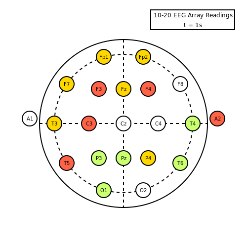
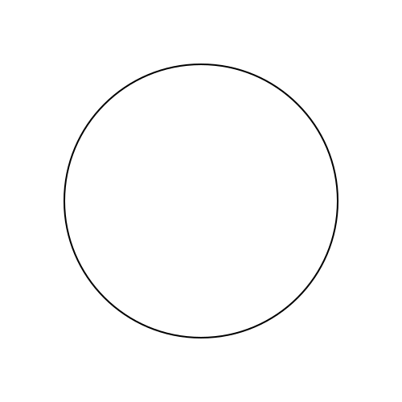
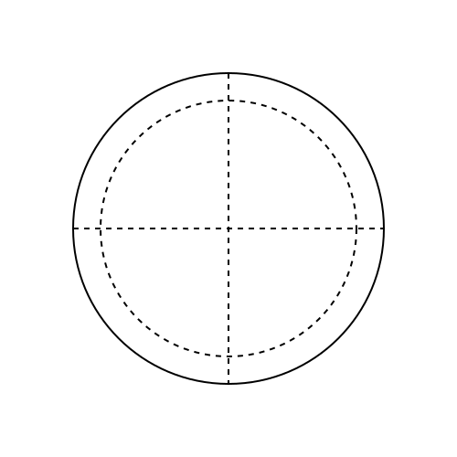
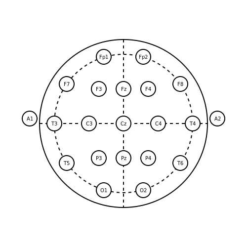
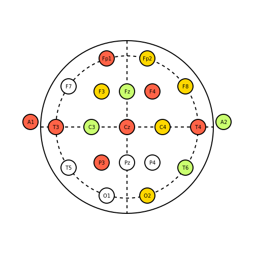

# **Tutorial 2:** What Are Actions?

In this tutorial, we are going to learn how to make a brain! 🧠 
Well, not _exactly_ making a brain. 
Instead, we are going to animate brain activity by simulating a [10-20 EEG Electrode Array](https://en.wikipedia.org/wiki/10%E2%80%9320_system_(EEG)?oldformat=true) using random data. 
This Project Tutorial builds on prior tutorials and serves as a cumulative test of your understanding about `Javis`.

When you are done with this tutorial, you will have created the following animation:



## Learning Outcomes

From this project tutorial you will:

- Clearly understand how to use Actions to create an animation
- Be able to create more complex animations
- Display meaningful information on your animations

## Setting Up Our Animation

As demonstrated in prior tutorials, we will use `Javis` to create a `Video` object:

```julia
using Javis

video = Video(500, 500)
```

Let's define our background function to create the backdrop of our frames:

```julia
function ground(args...)
    background("white")
    sethue("black")
end
```

If we were to execute the `javis` command now, this is what would appear as an output of the following execution:

```julia
video = Video(500, 500)
javis(video, [BackgroundAction(1:30, ground)], pathname = "eeg.gif", framerate = 1)
```


As you can see, we have generated a blank gif.
Not exactly what we want but it is a start!
We used a special type of action called [`BackgroundAction`](@ref).
This applies whatever function that is provided to it as the default background of any future animations produced by a future action.

> **NOTE:** For this animation, we will be using a framerate of 1 frame per second.
> Thus, why `framerate` is set to the value of `1` in `javis`.

## Getting A - _head_

Now that we have created our default background via the `BackgroundAction`, let's move onto making the head that we will attach our electrodes to!

First, we define an additional function that allows us to draw a circle.
This will be used extensively later:

```julia
function circ(p = O, color = "black", action = :fill, radius = 25, edge = "solid")
    sethue(color)
    setdash(edge)
    circle(p, radius, action)
end
```

We can now do the exciting part -- using an [`Action`](@ref)!
Actions are at the very heart of the entire `Javis` library and are the foundational building blocks to make animations.
Actions are what is used to draw objects on a frame, animate objects, or change objects altogether!

Using the `circ` function we defined, we can execute an `Action` inside of the `javis` function to draw a head.
The following invocation will create the head:

```julia
...
    Action(:same, :head, (args...) -> circ(O, "black", :stroke, 170)),
...
```



Now we are getting a - _head_! 😃

> **NOTE:** The ellipses, `...`, in the code block to produce the head represents putting the action inside of the [`javis`](@ref) function.
> So, the above block actually turns out to look like this:
> ``````julia
> javis(video, [
>     Action(:same, :head, (args...) -> circ(O, "black", :stroke, 170))],
>     pathname = "eeg.gif", framerate = 1)
> ``````

## Placing the Electrodes

To draw our electrodes, it would be useful to have a frame of reference for where the electrodes are supposed to go.
Let's draw some axes for our electrode locations!

We will need to define a new function that allows us to draw lines.
This is accomplished by the following function definition:

```julia
function draw_line(p1 = O, p2 = O, color = "black", action = :stroke, edge = "solid")
    sethue(color)
    setdash(edge)
    line(p1, p2, action)
end
```

Now, we can add in some grid lines for our electrode array. 
The following code places a vertical and horizontal axis as well as an inscribed circle to represent polar placement of the electrodes:

```julia
...
        Action(
            :same,
            :inside_circle,
            (args...) -> circ(O, "black", :stroke, 140, "longdashed"),
        ),
        Action(
            :same,
            :vert_line,
            (args...) ->
                draw_line(Point(0, -170), Point(0, 170), "black", :stroke, "longdashed"),
        ),
        Action(
            :same,
            :horiz_line,
            (args...) ->
                draw_line(Point(-170, 0), Point(170, 0), "black", :stroke, "longdashed"),
...
```



Great!
Now that we have the gridlines, let's add in our electrode!

> **NOTE:** If you noticed, we used Symbols to mark each `Action`.
> `id`'s can actually be used to store the returns of a function called via an `Action`.
> This functionality was introduced in [Tutorial 1](/tutorials/tutorial_1.html) and will be further explored in future tutorials.
> An alternative syntax that is valid is to leave out the `id` and instead use a comment to mark what `Action` does what. 

We have to define our own function to create an electrode.
The following code accomplishes this goal:

```julia
function electrode(
    p = O,
    fill_color = "white",
    outline_color = "black",
    action = :fill,
    radius = 25,
    circ_text = "",
)
    sethue(fill_color)
    circle(p, radius, :fill)
    sethue(outline_color)
    circle(p, radius, :stroke)
    text(circ_text, p, valign = :middle, halign = :center)
end
```

Essentially, all the `electrode` function does is draws two circles on top of each other.
One circle creates a white circle for the backdrop of text provided to it and the other circle provides a black outline. 

From there, we need to position our electrodes!
I already went through and created two lists: 
- `electrode_locations` is a list of `Point` objects that defines where an electrode should be placed.
- `electrode_names` are the names of each electrode.

Go ahead and copy this to save yourself the time to place these perfectly.
I already did this for you - aren't I great? 😉

```julia
electrode_locations = [
    O,
    Point(-70, 0),
    Point(70, 0),
    Point(-140, 0),
    Point(140, 0),
    Point(0, 70),
    Point(-50, 70),
    Point(50, 70),
    Point(0, -70),
    Point(-50, -70),
    Point(50, -70),
    Point(115, -80),
    Point(-115, -80),
    Point(115, 80),
    Point(-115, 80),
    Point(40, -135),
    Point(-40, -135),
    Point(-190, -10),
    Point(190, -10),
    Point(-40, 135),
    Point(40, 135),
]


electrode_names = [
    "Cz",
    "C3",
    "C4",
    "T3",
    "T4",
    "Pz",
    "P3",
    "P4",
    "Fz",
    "F3",
    "F4",
    "F8",
    "F7",
    "T6",
    "T5",
    "Fp2",
    "Fp1",
    "A1",
    "A2",
    "O1",
    "O2",
]
```

Finally, we can broadcast these points and names to our previously defined `electrode` function:

```julia
...
        Action(
            :electrodes,
            (args...) ->
                electrode.(
                    electrode_locations,
                    "white",
                    "black",
                    :fill,
                    radius,
                    electrode_names,
                ),
        ),
...
```

Now, executing this code block with our previously defined functions, we get this output:



## "If Only I Had a Brain..." 🎵

I think this is starting to come together quite nicely!
It would appear that our subject however has no brain activity - quite alarming! 😱
Like the scarecrow from the film, _The Wizard of Oz_, let's give him a brain!

To simulate brain activity, we are going to add one more package from Julia base.
This package is the `Random` package and it needs to be added like such:

```julia
using Javis
using Random
```

From there, we need to define colors to represent no, low, medium, and high brain activity.
Feel free to change up the colors!
I chose these colors that need to be added to your code:

```julia
indicators = ["tomato", "darkolivegreen1", "gold1", "white"]
```

From there, we also need to change the code block that defined the electrode locations.
The previous electrode code looked like this

```julia
...
        Action(
            :electrodes,
            (args...) ->
                electrode.(
                    electrode_locations,
                    "white",
                    "black",
                    :fill,
                    radius,
                    electrode_names,
                ),
        ),
...
```

However, what we now need to change is `"white"` to `rand(indicators)` for each electrode.
An example resulting electrode would look like this:

```julia
...
        Action(
            :electrodes,
            (args...) ->
                electrode.(
                    electrode_locations,
		    rand(indicators),
                    "black",
                    :fill,
                    radius,
                    electrode_names,
                ),
        ),
...
```

Once all these modifications were made, execute your EEG and you should get something that looks like this:



IT'S ALIVE!!! 🔬
We could finish this now, but let's add just a little bit more polish to it.

## As You Can See Here...

Let's add some information to our animation. 
We can create an info box using the following function:

```julia
function info_box(video, action, frame)
    fontsize(12)
    box(140, -210, 170, 40, :stroke)
    text("10-20 EEG Array Readings", 140, -220, valign = :middle, halign = :center)
    text("t = $(frame)s", 140, -200, valign = :middle, halign = :center)
end
```

It's invocation in the code looks like this:

```julia
...
Action(:same, :info, info_box),
...
```

> **NOTE:** The function for `info_box` is a little different!
> Each `Action` inside of the `javis` function automatically receives three objects being a `Video` object, which was previously defined outside of the `javis` function, the `Action` object, and the current frame number. 

Once everything is executed, we get this very nice and clean looking animation which shows what this animation is and when parts of the brain are activated:


## Conclusion

Congratulations! 🎉 🎉 🎉
You made a brain! 
To recap, by working through this animation you should now:

1. Clearly understand how to use an `Action` 
2. Be able to create your own `Action`
3. Know how to approach complex animations
4. Make meaningful information displayed easily on your animations

Great job leveling up your `Javis` skills! 💪

## Full Code

In case you ran into any issues or confusion, here is the full code:

```julia
using Javis
using Random

function ground(args...)
    background("white")
    sethue("black")
end

function draw_line(p1 = O, p2 = O, color = "black", action = :stroke, edge = "solid")
    sethue(color)
    setdash(edge)
    line(p1, p2, action)
end

function circ(p = O, color = "black", action = :fill, radius = 25, edge = "solid")
    sethue(color)
    setdash(edge)
    circle(p, radius, action)
end

function info_box(video, action, frame)
    fontsize(12)
    box(140, -210, 170, 40, :stroke)
    text("10-20 EEG Array Readings", 140, -220, valign = :middle, halign = :center)
    text("t = $(frame)s", 140, -200, valign = :middle, halign = :center)
end

function electrode(
    p = O,
    fill_color = "white",
    outline_color = "black",
    action = :fill,
    radius = 25,
    circ_text = "",
)
    sethue(fill_color)
    circle(p, radius, :fill)
    sethue(outline_color)
    circle(p, radius, :stroke)
    text(circ_text, p, valign = :middle, halign = :center)
end

electrode_locations = [
    O,
    Point(-70, 0),
    Point(70, 0),
    Point(-140, 0),
    Point(140, 0),
    Point(0, 70),
    Point(-50, 70),
    Point(50, 70),
    Point(0, -70),
    Point(-50, -70),
    Point(50, -70),
    Point(115, -80),
    Point(-115, -80),
    Point(115, 80),
    Point(-115, 80),
    Point(40, -135),
    Point(-40, -135),
    Point(-190, -10),
    Point(190, -10),
    Point(-40, 135),
    Point(40, 135),
]

electrode_names = [
    "Cz",
    "C3",
    "C4",
    "T3",
    "T4",
    "Pz",
    "P3",
    "P4",
    "Fz",
    "F3",
    "F4",
    "F8",
    "F7",
    "T6",
    "T5",
    "Fp2",
    "Fp1",
    "A1",
    "A2",
    "O1",
    "O2",
]

radius = 15
indicators = ["tomato", "darkolivegreen1", "gold1", "white"]
demo = Video(500, 500)
javis(
    demo,
    [
        BackgroundAction(1:10, ground),
        Action(
            :inside_circle,
            (args...) -> circ(O, "black", :stroke, 140, "longdashed"),
        ),
        Action(:head, (args...) -> circ(O, "black", :stroke, 170)),
        Action(
            :vert_line,
            (args...) ->
                draw_line(Point(0, -170), Point(0, 170), "black", :stroke, "longdashed"),
        ),
        Action(
            :horiz_line,
            (args...) ->
                draw_line(Point(-170, 0), Point(170, 0), "black", :stroke, "longdashed"),
        ),
        Action(
            :electrodes,
            (args...) ->
                electrode.(
                    electrode_locations,
                    rand(indicators, length(electrode_locations)),
                    "black",
                    :fill,
                    radius,
                    electrode_names,
                ),
        ),
        Action(:info, info_box),
    ],
    pathname = "eeg.gif",
    framerate = 1,
)

```

---
---

> **Author(s):** Jacob Zelko, Ole Kröger \
> **Date:** August 11th, 2020 \
> **Tag(s):** brain, EEG, project, tutorial, electrodes, Action, BackgroundAction
