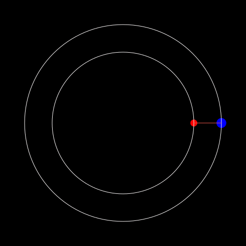
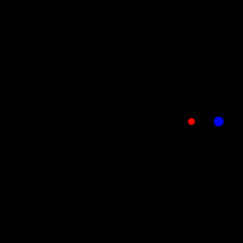
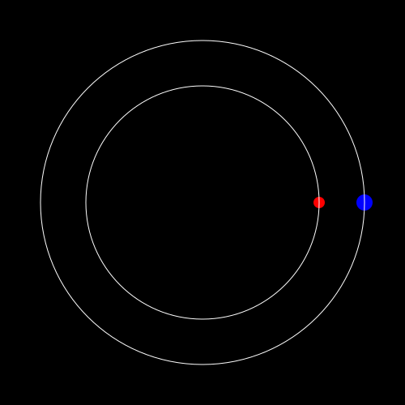
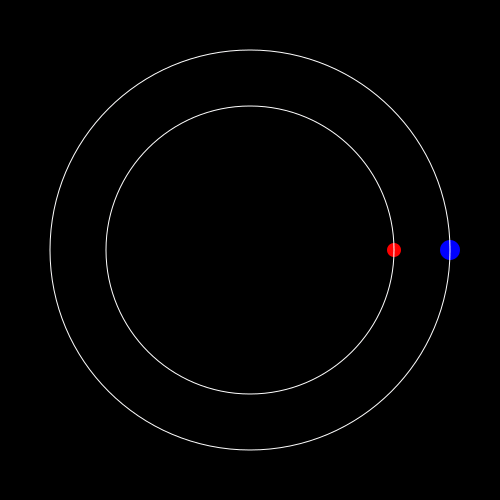
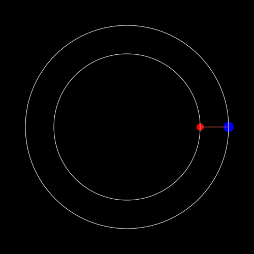
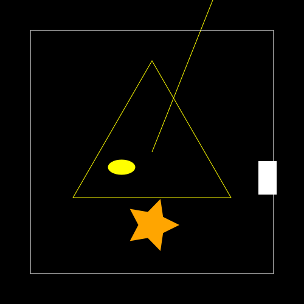

# **Tutorial 2:** Cosmic Dancing and Javis Shorthand Expressions!

In the previous tutorial, when you were creating the red and blue balls, you came across syntax that looked something like this:

```
(args...) -> object(....)
```

As promised, here is the explanation of what this syntax is: 
It declares an anonymous function that eases Javis rendering.
If you are new to Julia or haven't worked with anonymous function declarations before,  this can be quite difficult to understand! 🤯

Even for seasoned Julians, this syntax can make it hard to see everything that is happening in your code. 
But, have no fear, Javis shorthand expressions are here!
Javis shorthand expressions, also affectionately referred to as J-Objects, are Javis-made expressions that define commonly used objects via a simple syntax.

By the end of this tutorial, you will have made the following animation with J-Objects that follows the paths of Earth and Venus while going around the sun in a beautiful Cosmic Dance!



## Learning Outcomes

Through this tutorial you will be introduced to Javis shorthand expressions and specifically learn about the following J-Objects provided by Javis:

- `JCircle`
- `JShape`

This will help you more easily create animations using Javis!

## Space... The Final Frontier! 🌌 🌠 

### An Infinite Cosmos

To start things slowly, let's create a space in the infinite cosmos where our planets will perform their cosmic dance!
Meaning: let's create the Background!

```julia
function ground(args...)
    background("black")
    sethue("white")
end
```

### 💥 ... Planets!

In our last tutorial, we created circles to represent planets. 
We'll be doing something similar but, this time, with J-Objects!

If you recall, we had to define our own special function to define a circle that we wanted to use in our last animation.
Now, instead, we will use, the J-Object, `JCircle`.

`JCircle` is pretty flexible and takes in arguments similar to Luxor.jl's `circle()` function that we used in the previous tutorial.
However, we do not have to use the verbose syntax as before, but instead, we can use a much more readable syntax.
For example, we can define Earth and Venus as shown below:

```julia
function ground(args...)
    background("black")
    sethue("white")
end

frames = 1000

myvideo = Video(500, 500)
Background(1:frames, ground)

earth = Object(1:frames, JCircle(O, 10, color = "blue", action = :fill), Point(200, 0))
venus = Object(JCircle(O, 7, color = "red", action = :fill), Point(144, 0))

render(myvideo; pathname = "cosmic_dance.gif")
```



Tada! 💥 We have created our own galaxy!
Now that we have created some planets, we should map their orbits - we don't want them crashing into each other!

### Swiftly Tilting Axes 🌐

In the previous tutorial we used a `path!` function to create the orbits of the planets. 
In its place, we will use `@JShape` to trace out the orbits of the planets. 

`@JShape` is a macro that allows users to create complex objects with custom settings - all using J-Object syntax!
All the parameters used inside `@JShape`, such as defining colors or actions, are within the `begin...end` provided by the macros. 

Here is how we use `@JShape` to define the orbits of a planet:

```julia
...

earth = Object(1:frames, JCircle(O, 10, color = "blue", action = :fill), Point(200, 0))
venus = Object(JCircle(O, 7, color = "red", action = :fill), Point(144, 0))

earth_orbit = Object(@JShape begin
    sethue(color)
    setdash(edge)
    circle(O, 200, action)
end color = "white" action = :stroke edge = "solid")

venus_orbit = Object(@JShape begin
    sethue(color)
    setdash(edge)
    circle(O, 144, action)
end color = "white" action = :stroke edge = "solid")

render(myvideo; pathname = "cosmic_dance.gif")
```



### Let's Get Moving! 🏎️

Now that we have the paths of the planets defined, and our planets created, I think something is missing...
Oh! Let's set them in motion!
For that, we will use some `Action`'s to make them move (read the code comments to see how that happens):

```julia
...

# We need the planets to revolve according to their time periods.
# Earth completes its one revolution in 365 days and Venus does that in 224.7 days.
# Hence, we need to multiply (224.7/365) so that the time period matches properly i.e.,
# When earth completes its full revolution, Venus has done (224.7/365) th of its revolution.
act!(earth, Action(anim_rotate_around(12.5 * 2π * (224.7 / 365), O)))
act!(venus, Action(anim_rotate_around(12.5 * 2π, O)))

render(myvideo; pathname = "cosmic_dance_revolution.gif")
```



### A Beautiful Dance 🌸

Now that we have our planets moving, it would be interesting to see how the space between them changes over time.
So, using our `@JShape` macro and "connector" syntax we used in the last tutorial, we can do just that!
Let's trace out their changing paths that Earth and Venus follow!

```julia
...

connection = [] # To store the connectors
Object(@JShape begin
    sethue(color)
    push!(connection, [p1, p2])
    map(x -> line(x[1], x[2], :stroke), connection)
end connection = connection p1 = pos(earth) p2 = pos(venus) color = "#f05a4f")

render(myvideo; pathname = "cosmic_dance_path.gif")
```



Like real dancers, watching this animation is both beautiful and trance like.
Great job making this! 

# Conclusion

Good work on getting through this tutorial!
By learning how to make this animation, you now know a bit more about J-Objects and how they can make creating Javis animations easier and also more readable.
You should note, the other syntax is still supported and for some more complex animations, that syntax might be better than J-Objects.

Also, J-Objects don't end here!
Javis supports a variety of additional J-Objects you should consider using!
For example:

```julia
function ground(args...)
    background("black")
    sethue("white")
end

frames = 1

myvideo = Video(500, 500)
Background(1:frames, ground)

# Line
Object(1:frames, JLine(Point(100, -250), color = "yellow"))

# Box
Object(JBox(Point(-200, -200), Point(200, 200), color = "white", action = :stroke))

# Rect
Object(JRect(175, 15, 30, 55, color = "white", action = :fill))

# Ellipse
Object(JEllipse(-50, 25, 45, 25, color = "yellow", action = :fill))

# Star
Object(JStar(0, 120, 45, color = "orange", action = :fill))

# Polygon
Object(JPoly(ngon(O, 150, 3, -π / 2, vertices = true), color = "yellow"))

render(myvideo; pathname = "shorthand_examples.gif")
```



That said, congrats and go forth and make more animations!
We are excited to see what you create!

# Full Code

```julia
using Javis

function ground(args...)
    background("black")
    sethue("white")
end

frames = 1000

myvideo = Video(500, 500)
Background(1:frames, ground)

earth = Object(1:frames, JCircle(O, 10, color = "blue", action = :fill), Point(200, 0))
venus = Object(JCircle(O, 7, color = "red", action = :fill), Point(144, 0))

earth_orbit = Object(@JShape begin
    sethue(color)
    setdash(edge)
    circle(O, 200, action)
end color = "white" action = :stroke edge = "solid")

venus_orbit = Object(@JShape begin
    sethue(color)
    setdash(edge)
    circle(O, 144, action)
end color = "white" action = :stroke edge = "solid")

# We need the planets to revolve according to their time periods.
# Earth completes its one revolution in 365 days and Venus does that in 224.7 days.
# Hence, we need to multiply (224.7/365) so that the time period matches properly i.e.,
# When earth completes its full revolution, Venus has done (224.7/365) th of its revolution.
act!(earth, Action(anim_rotate_around(12.5 * 2π * (224.7 / 365), O)))
act!(venus, Action(anim_rotate_around(12.5 * 2π, O)))

connection = [] # To store the connectors
Object(@JShape begin
    sethue(color)
    push!(connection, [p1, p2])
    map(x -> line(x[1], x[2], :stroke), connection)
end connection = connection p1 = pos(earth) p2 = pos(venus) color = "#f05a4f")

render(myvideo; pathname = "cosmic_dance.gif")

```

> **Author(s):** Arsh Sharma \
> **Date:** July 7th, 2021 \
> **Tag(s):** shorthands, object, action, rotation \
> **Credit(s):** Ved Mahajan for the cosmic dance example

