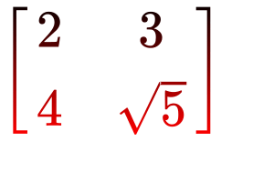
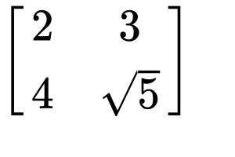

# **Tutorial 3:** Rendering LaTeX with Javis!

This is a rather brief tutorial about an exciting functionality of `Javis.jl`: the ability to render $\LaTeX$!

If you have never heard of `LaTeX` before, we highly recommend these resources:

- [What Is `LaTeX`?](https://www.wikiwand.com/en/LaTeX?wprov=srpw1_0)
- [Learn `LaTeX` in 30 minutes](https://www.overleaf.com/learn/latex/Learn_LaTeX_in_30_minutes)

When you are done with this tutorial, you will have created the following visualization:



## Learning Outcomes

From this project tutorial you will:

- Learn how to render `LaTeX` using Javis.

## Set Up

As demonstrated in prior tutorials, we will use `Javis` to create a `Video` object. 
However, we also have one more package included this time - [`LaTeXStrings`](https://github.com/stevengj/LaTeXStrings.jl)!

It is a great package that can be installed via the following command:

```
julia> ] add LaTeXStrings
```

Now that it is installed, we need to use the following packages for this tutorial: 

```julia
using Javis
using LaTeXStrings
```

`LaTeXStrings.jl` is a tool that allows for the convenient input and display of `LaTeX` equations using Julia `String` objects.
It requires a special syntax which looks like this:

```julia
my_latex_string = L"9\frac{3}{4}"
```

Which would then render to this `LaTeX`:

$$9\frac{3}{4}$$

Let's define our background function to create the backdrop of our frames:

```julia
function ground(args...)
    background("white")
    sethue("black")
end
```

Since we are making a visualization, we will only generate one frame and set the framerate to 1:

```julia
demo = Video(300, 200)
Background(1:1, ground)
render(demo; pathname = "latex.gif", framerate = 1)
```

Finally, we need to install a node package and additional Julia package for this tutorial.
If you are unfamiliar with node, please visit their [website for more information to set-up node on your machine](https://nodejs.org/en/).

> **ATTENTION: This next step is critical or else you WILL encounter numerous errors. 
> If you have not installed node, this tutorial WILL fail for you.** 

We can accomplish this with the following execution

```js
npm install -g mathjax-node-cli
```

Currently, Julia does not have the ability (yet) to render `LaTeX` natively. 
Therefore, we must install an additional node package.
Sadly. 😭

## The Writing on the Wall 📝 

Now, let's render some `LaTeX`!
To do so, we will define an additional function that we will call, `draw_latex`.
Here is the code:

```julia
function draw_latex(video, action, frame)
    fontsize(50)
    latex(
        L"""\begin{equation}
        \left[\begin{array}{cc} 
        2 & 3 \\  4 & \sqrt{5} \\  
        \end{array} \right] 
        \end{equation}""",
        O,
        valign = :middle,
        halign = :center
    )
end
```

Here is what this function does:

The `latex` function is called to render a `LaTeXString` object.
This particular string makes a matrix! The positional argument `O` specifies the top left
corner for placing the latex text. The last 2 arguments specify the alignment with respect 
to the top left corner point. These are optional and default to `:top` and `:left` respectively.

> **NOTE:** The default position is the origin (default: the center of the canvas)

We can run this code block to render the `LaTeX` by adding an `Object` under the `Background` line

```julia
Object(draw_latex)
```

Which produces the following visualization:



_Math-magical!_ ✨
You just rendered your first bit of `LaTeX` using `Javis`!
But, I must say, it looks quite...
Bland. 😐

Let's spice it up!

## Throw it in the Blender!

A fun function that `Luxor` provides is the ability to blend colors together!
To do so, let's modify the `draw_latex` function:

```julia
function draw_latex(video, action, frame)
    black_red = blend(O, Point(0, 150), "black", "red")
    setblend(black_red)
    fontsize(50)
    latex(
        L"""\begin{equation}
        \left[\begin{array}{cc} 
        2 & 3 \\  4 & \sqrt{5} \\  
        \end{array} \right] 
        \end{equation}""",
        O,
        valign = :middle,
        halign = :center
    )
end
```

The biggest change is that we added the `blend` and `setblend` functions.
`blend` creates a linear blend between two points using two given colors - in this case, black and red.
`setblend` applies the blend to the drawn object. 
We also use the `translate` function this time as it makes writing the `blend` function easier.

Can you guess what happens when we execute the code with this newly updated `draw_latex` function?
Here is what the output looks like:


Now that matrix looks, **AWESOME**. 😎

## Conclusion

Well done!
You just finished a brief introduction to using `LaTeX` in `Javis`!
There is more you can with `Javis` and `LaTeX` which will be explored in future tutorials.

As a reminder, you just learned how to render `LaTeX` using `Javis`!
Go forth and produce more wonderful $\LaTeX$ creations! 

## Full Code

In case you ran into any issues or confusion, here is the full code:

```julia
using Javis
using LaTeXStrings

function ground(args...)
    background("white")
    sethue("black")
end

function draw_latex(video, action, frame)
    black_red = blend(O, Point(0, 150), "black", "red")
    setblend(black_red)
    fontsize(50)
    latex(
        L"""\begin{equation}
        \left[\begin{array}{cc} 
        2 & 3 \\  4 & \sqrt{5} \\  
        \end{array} \right] 
        \end{equation}""",
        O,
        :middle,
        :center
    )
end

demo = Video(300, 200)
Background(1:1, ground)
Object(draw_latex)
render(demo; pathname = "latex.gif", framerate=1)
```

---
---

> **Author(s):** Jacob Zelko \
> **Date:** August 16th, 2020 \
> **Tag(s):** latex, blend, LaTeXStrings, node
