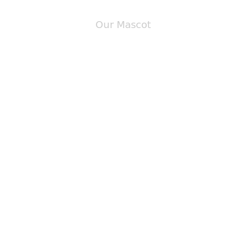

# **Tutorial 4:** Do You Know Our Mascot? - Learn About Transitions And Actions!

You have learned a couple of cool features of Javis already. Now you're ready to finally meet our little mascot. Well actually you can't just see him, we have to create him first. 😄

## Our goal

Let's create a list of what we want first
- a circular head
- some hair
- eyes
- a nose
- a moving mouth
- he should say something

## Learning Outcomes

This tutorial demonstrates the power of actions a bit more than the previous tutorials.
An [`Action`](@ref) can be used to finely manipulate objects in your animation or visualization. 

From this tutorial, you will learn how to:

1. Finely control objects by making them appear and disappear using an `Action`.
2. Move objects using an `Action`.
3. Learn how to create several objects quickly

## Starting with the Basics of SubAction

The `ground` function should be familiar to you as well as the general structure of the code if you have seen the first [tutorial](tutorial_1.md).
In this tutorial, rather than calling the `render` function in the global space, we are going to be calling it from the function we are creating to create our mascot, `face`: 

```julia
using Javis

function ground(args...)
    background("white")
    sethue("black")
end

function title(args...)
    fontsize(20)
    text("Our Mascot", Point(0, -200),
        valign=:middle, halign=:center)
end

function face()
    video = Video(500, 500)
    Background(1:150, ground)
    the_title = Object(title)
    act!(the_title, Action(1:5, appear(:fade)))
    render(video; pathname="jarvis.gif", framerate=15)
end
```

> **NOTE:** For an `Object` you can leave the frames arg blank. 
> The frames from the previous action are used. 

A function of an `Action` is normally either [`appear`](@ref) or [`disappear`](@ref) at the moment or one of these transformations: [`anim_translate`](@ref), [`anim_rotate`](@ref)/[`anim_rotate_around`](@ref) and [`anim_scale`](@ref).

In theory you can define your own but that is way outside of this tutorial.

**Let's summarize the functionality:**

We have created a [`Background`](@ref) as usual and an [`Object`](@ref) with the same number of frames. The object is saved in a variable `the_title` such that we can [`act!`](@ref) on it with an [`Action`](@ref). In this case we let the title fade in for the first five frames.

## The Upper Part of the Head

Let's continue with a bit more before we draw part of the mascot.

The following actions will just be added below the last action.

```julia
head = Object(16:150, (args...)->circle(O, 100, :stroke))
act!(head, Action(1:15, appear(:fade)))
```

This is very similar to the previous code. Here we can see that the `Action` uses relative frame numbers such that the head appears in the frames `16:30` and then is at full opacity afterwards.

> **NOTE:** Just a small refresher: We need the anonymous function `(args...)->circle(O, 100, :stroke)` as each function gets called with the three arguments `video, action, frame`.

### Let's not be to bald

Okay let's add some hair shall we?

I want to have some randomness in his hair so let's define:

```julia
hair_angle = rand(-0.9:0.1:0.9, 20)
```

at the beginning of the `face` function.

and have a hair function:

```julia
function hair_blob(angle)
    sethue("brown")
    rotate(angle)
    circle(Point(0, -100), 20, :fill)
end
```

It draws one brown hair blob given the angle. We basically rotate the whole canvas and then draw the circle always at the same local position. 

Now how do we draw the hair without creating an action for each blob?

Well we actually create an Action for each blob but only internally. You can use the [`act!`](@ref) function.

```julia
hair = Object[]
for i = 1:20
    push!(hair, Object(26:150, (args...)->hair_blob(hair_angle[i])))
end
act!(hair, Action(1:25, appear(:fade)))
```

We first create a vector where we define that its a vector of `Object` and then push new objects to it. Afterwards we can apply an action to the whole group.

I think you get the idea of how to use `appear` now. Let's add some eyes and a nose quickly before we draw our first gif.

```julia
the_eyes = Object(30:150, (args...)->eyes(eye_centers, 10, "darkblue"))
act!(the_eyes, Action(1:15, appear(:fade)))

the_nose = Object(45:150, (args...)->poly(nose, :fill))
act!(the_nose, Action(1:15, appear(:fade)))
```

with:

```julia
eye_centers = [Point(-40,-30), Point(40,-30)]
nose = [O, Point(-10,20), Point(10, 20), O]
```

and

```julia
function eyes(centers, radius, color)
    sethue(color)
    circle.(centers, radius, :fill)
    setcolor("white")
    circle.(centers, radius/5, :fill)
end
```



## Using Transformations

Let's give him some moving lips so he can communicate with us:

```julia
upper_lip = [Point(-40, 45), Point(40, 45)]
lower_lip = [Point(-40, 55), Point(40, 55)]
```

These are just the outer points of the lips:

```julia
function lip(p1, p2)
    setline(2)
    move(p1)
    c1 = p1 + Point(10, 10)
    c2 = p2 + Point(-10, 10)
    curve(c1, c2, p2)
    do_action(:stroke)
end
```

This function uses some more functions of the awesome Luxor package.

The lips should be a little thicker than the other lines that we have drawn so far so let's set `setline(2)`. (default is 1).
First we move to the starting point of the lip and create two control points a bit below and to the vertical center.

The `curve` function is used to draw a cubic [Bézier curve](https://en.wikipedia.org/wiki/B%C3%A9zier_curve). 
It unfortunately doesn't support the `:stroke` at the end so we have to do this with `do_action(:stroke)` this time.

Now our two actions:

```julia
lip_fade_in = Action(1:15, appear(:fade))
the_upper_lip = Object(60:150, (args...)->lip(upper_lip...))
act!(the_upper_lip, lip_fade_in)
act!(the_upper_lip, [Action(20i:20i+10, anim_translate(0, -5)) for i in 1:5])
act!(the_upper_lip, [Action(20i+10:20i+20, anim_translate(0, 5)) for i in 1:5])

the_lower_lip = Object(60:150, (args...)->lip(lower_lip...))
act!(the_lower_lip, lip_fade_in)
act!(the_lower_lip, [Action(20i:20i+10, anim_translate(0, 5)) for i in 1:5])
act!(the_lower_lip, [Action(20i+10:20i+20, anim_translate(0, -5)) for i in 1:5])
```

We fade them in at the beginning and then they shall move up and down a couple of times.

In this snippet you can see that we can define a more general action which isn't applied to an object at the stage of creation.
You can also use the `act!` function to apply a list of actions to an object like. 

Finally let him speak:

```julia
function speak(str)
    fontsize(15)
    text(str, Point(100, 50))
end
```


```julia
speaking1 = Object(80:120, (args...)->speak("I'm Jarvis"))
act!(speaking1, Action(1:5, appear(:draw_text)))
act!(speaking1, Action(36:40, disappear(:draw_text)))

speaking2 = Object(120:150, (args...)->speak("How are you?"))
act!(speaking2, Action(1:5, appear(:draw_text)))
act!(speaking2, Action(36:40, disappear(:draw_text)))  
```

This time we also use the [`disappear`](@ref) function to fade out the text. Additionally, it shows you a new input into [`appear`](@ref) and [`disappear`](@ref) which only works for text namely `:draw_text` which draws the text from left to right.

Now, with everything properly defined within the `face` function one can simply execute the following from your Julia REPL:

```
julia> face()
```

To produce the following:


Jarvis is alive! 

## Conclusion

To recap, by working through this animation you should now:

1. Understand how to make objects appear and disappear using actions
2. Be able to move objects inside actions to have a finer control of the movement
3. Know how to use apply several actions to an object

Hope you had as much fun reading this tutorial as I had creating our mascot.

You're now ready to create your own big project.

## The Code

```julia
using Javis

function ground(args...)
    background("white")
    sethue("black")
end

function title(args...)
    fontsize(20)
    text("Our Mascot", Point(0, -200),
        valign=:middle, halign=:center)
end

function hair_blob(angle)
    sethue("brown")
    rotate(angle)
    circle(Point(0, -100), 20, :fill)
end

function eyes(centers, radius, color)
    sethue(color)
    circle.(centers, radius, :fill)
    setcolor("white")
    circle.(centers, radius/5, :fill)
end

function lip(p1, p2)
    setline(2)
    move(p1)
    c1 = p1 + Point(10, 10)
    c2 = p2 + Point(-10, 10)
    curve(c1, c2, p2)
    do_action(:stroke)
end

function speak(str)
    fontsize(15)
    text(str, Point(100, 50))
end

function face()
    eye_centers = [Point(-40,-30), Point(40,-30)]
    nose = [O, Point(-10,20), Point(10, 20), O]
    upper_lip = [Point(-40, 45), Point(40, 45)]
    lower_lip = [Point(-40, 55), Point(40, 55)]
    hair_angle = rand(-0.9:0.1:0.9, 20)

    video = Video(500, 500)
    Background(1:150, ground)
    the_title = Object(title)
    act!(the_title, Action(1:5, appear(:fade)))
    a = Object(16:150, (args...)->circle(O, 100, :stroke))
    act!(a, Action(1:15, appear(:fade)))
    
    hair = Object[]
    for i = 1:20
        push!(hair, Object(26:150, (args...)->hair_blob(hair_angle[i])))
    end
    act!(hair, Action(1:25, appear(:fade)))
    
    the_eyes = Object(30:150, (args...)->eyes(eye_centers, 10, "darkblue"))
    act!(the_eyes, Action(1:15, appear(:fade)))

    the_nose = Object(45:150, (args...)->poly(nose, :fill))
    act!(the_nose, Action(1:15, appear(:fade)))
    
    lip_fade_in = Action(1:15, appear(:fade))
    the_upper_lip = Object(60:150, (args...)->lip(upper_lip...))
    act!(the_upper_lip, lip_fade_in)
    act!(the_upper_lip, [Action(20i:20i+10, anim_translate(0, -5)) for i in 1:5])
    act!(the_upper_lip, [Action(20i+10:20i+20, anim_translate(0, 5)) for i in 1:5])

    the_lower_lip = Object(60:150, (args...)->lip(lower_lip...))
    act!(the_lower_lip, lip_fade_in)
    act!(the_lower_lip, [Action(20i:20i+10, anim_translate(0, 5)) for i in 1:5])
    act!(the_lower_lip, [Action(20i+10:20i+20, anim_translate(0, -5)) for i in 1:5])

    speaking1 = Object(80:120, (args...)->speak("I'm Jarvis"))
    act!(speaking1, Action(1:5, appear(:draw_text)))
    act!(speaking1, Action(36:40, disappear(:draw_text)))

    speaking2 = Object(120:150, (args...)->speak("How are you?"))
    act!(speaking2, Action(1:5, appear(:draw_text)))
    act!(speaking2, Action(36:40, disappear(:draw_text)))    
    render(video; pathname="jarvis.gif", framerate=15)
end

face()
```

> **Author(s):** Ole Kröger, Jacob Zelko \
> **Date:** August 14th, 2020 \
> **Tag(s):** jarvis, actions, fade, transformations
