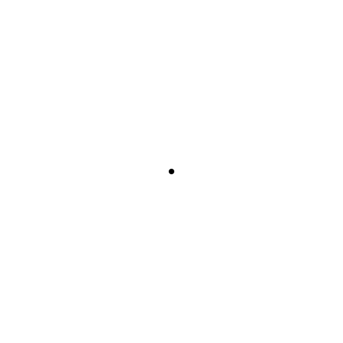

# **Tutorial 5:** Scaling the Elements

## Introduction

The world is built up of tiny tiny building blocks known as atoms. ⚛️
These atoms come in many different sizes and each has different properties.
Let's visualize these atoms and show their uniqueness!

## Learning Outcomes

In this tutorial you'll learn:

- How to apply scaling to an arbitrary shape
- Ways of creating educational gifs

By the end of this tutorial, you will have made the following animation:

## `PeriodicTable.jl` and `Unitful.jl`

As normal with our tutorials, we need to import first the packages we will be using.
In this tutorial, we are introducing two new packages:

1. `PeriodicTable.jl` - Periodic table render in Julia
2. `Unitful.jl` - Physical quantities with arbitrary units

These are straightforward to add to your Julia installation by executing the following in your Julia REPL:

```julia
julia> ] add Unitful, PeriodicTable
```

You might be wondering what these packages do.
Let's dive into them then!

`PeriodicTable.jl` enables one to look at information quickly related to the periodic table of elements.
One can even print out such a table in their Julia REPL by doing the following:

```julia
julia> using PeriodicTable

julia> elements
 Elements(…119 elements…):
H                                                  He
Li Be                               B  C  N  O  F  Ne
Na Mg                               Al Si P  S  Cl Ar
K  Ca Sc Ti V  Cr Mn Fe Co Ni Cu Zn Ga Ge As Se Br Kr
Rb Sr Y  Zr Nb Mo Tc Ru Rh Pd Ag Cd In Sn Sb Te I  Xe
Cs Ba    Hf Ta W  Re Os Ir Pt Au Hg Tl Pb Bi Po At Rn
Fr Ra    Rf Db Sg Bh Hs Mt Ds Rg Cn Nh Fl Mc Lv Ts Og
Uue
      La Ce Pr Nd Pm Sm Eu Gd Tb Dy Ho Er Tm Yb Lu
      Ac Th Pa U  Np Pu Am Cm Bk Cf Es Fm Md No Lr
```

As the famous Mythbuster, Adam Savage once said, "IT'S SCIENTIFIC!" 🧪 🤓
One can even query `PeriodicTable` to find out information on specific elements.
Let's look up Oxygen (O) here!

```julia
julia> elements[8]
 Oxygen (O), number 8:
        category: diatomic nonmetal
     atomic mass: 15.999 u
         density: 1.429 g/cm³
   melting point: 54.36 K
   boiling point: 90.188 K
           phase: Gas
          shells: [2, 6]
e⁻-configuration: 1s² 2s² 2p⁴
         summary: Oxygen is a chemical element with symbol O and atomic number 8. It is a member of the chalcogen group on the periodic table and is a highly reactive nonmetal and oxidizing agent that readily forms compounds (notably oxides) with most elements. By mass, oxygen is the third-most abundant element in the universe, after hydrogen and helium.
   discovered by: Carl Wilhelm Scheele
        named by: Antoine Lavoisier
          source: https://en.wikipedia.org/wiki/Oxygen
  spectral image: https://en.wikipedia.org/wiki/File:Oxygen_spectre.jpg
```

As fellow Julian, Johann-Tobias Schäg, said, one should learn `Unitful.jl` if they want to interact with the real world.
`Unitful.jl` handles physical quantites such as pounds, meters, mols, etc. with minimal overhead in Julia.
Further, it helps one to keep track of units and easily convert between different measurement systems.

## Setting Up Our Animation

As always, let's import our needed packages:

```julia
using Javis
using PeriodicTable
using Unitful
```

And let's define our background function:

```julia
function ground(args...)
    background("white")
    sethue("black")
end
```

Finally, let's get started with creating our `javis` function:

```julia
demo = Video(500, 500)
javis(
    demo,
    [
        BackgroundAction(1:500, ground),
	...
    ],
    pathname = "atomic.gif",
    framerate = 10,
)
```

As you can see, the animation we are creating is going to have many frames!
This is the longest animation we have made so far.
Why?
Not only are we going to examine many different elements, this tutorial also serves to illustrate how one can make longer animations to convey ideas.
Think of it as your directoral debut! 🎬 🎥

## Taming the Elements!

Each element has a different atomic mass.
This atomic mass is measured in the unit called a "Dalton" (symbol: u) which is equivalent to 1/12 of the mass of a stationary carbon-12 atom.
We can use the `Scaling` functionality that `Javis.jl` provides to visualize these different masses!

To accomplish this, we need to make a function the shows our currently viewed element:

```julia
function element(p = O, color = "black")
    sethue(color)
    c = circle(p, 1, :fill)
end
```

Essentially, all the `element` function does is create a circle in the middle of the frame with the initial size of 1.

From there, we need to define more `Action` objects for our `javis` function for the element we are viewing to scale:

```julia
...
        Action(
            (args...) -> element(),
            subactions = [
                SubAction(1:300, Scaling(1, 30)),
                SubAction(301:350, Scaling(30, 16)),
            ],
        ),
	...
        pathname = "atomic.gif",
        framerate = 10
    )
...
```

This will grow our element from `1` to `30` and then shrink the element from `30` to `16`.

That scaling looks like this:



Staring at this somewhat makes me think of a black hole... ⚫
But great!
The only question now is... What are we looking at?
Let's add some more information to this animation! 📝

## Name That Element! 🔬

## Conclusion

> **Author(s):** Ole Kröger, Jacob Zelko \
> **Date:** September 3rd, 2020 \
> **Tag(s):** action, rotation
