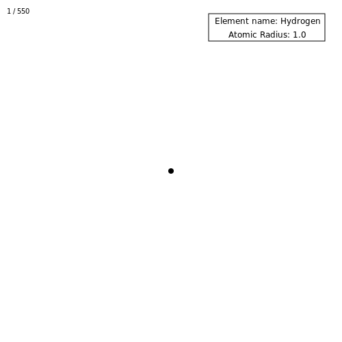
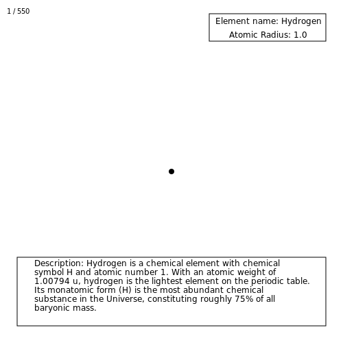

# **Tutorial 5:** Scaling the Elements

## Introduction

The world is built up of tiny tiny building blocks known as atoms. ⚛️
These atoms come in many different sizes and each has different properties.
Let's visualize these atoms and show their uniqueness!

> P.S. This tutorial is not 100% representative of real life. If you spot the inaccuracy, feel free to open a PR. 😉

## Learning Outcomes 📚

In this tutorial you'll learn:

- How to apply scaling to an arbitrary shape
- To use `Javis.jl` to interact with the following Julia packages:
    - [`Unitful.jl`](https://github.com/PainterQubits/Unitful.jl)
    - [`PeriodicTable.jl`](https://github.com/JuliaPhysics/PeriodicTable.jl)

- Ways of creating educational gifs

By the end of this tutorial, you will have made the following animation:

## `PeriodicTable.jl` and `Unitful.jl`

As normal with our tutorials, we need to import first the packages we will be using.
In this tutorial, we are introducing two new packages:

1. `PeriodicTable.jl` - Periodic table render in Julia
2. `Unitful.jl` - Physical quantities with arbitrary units

These are straightforward to add to your Julia installation by executing the following in your Julia REPL:

```julia
julia> ] add Unitful, PeriodicTable
```

You might be wondering what these packages do.
Let's dive into them then!

`PeriodicTable.jl` enables one to look at information quickly related to the periodic table of elements.
One can even print out such a table in their Julia REPL by doing the following:

```julia
julia> using PeriodicTable

julia> elements
 Elements(…119 elements…):
H                                                  He
Li Be                               B  C  N  O  F  Ne
Na Mg                               Al Si P  S  Cl Ar
K  Ca Sc Ti V  Cr Mn Fe Co Ni Cu Zn Ga Ge As Se Br Kr
Rb Sr Y  Zr Nb Mo Tc Ru Rh Pd Ag Cd In Sn Sb Te I  Xe
Cs Ba    Hf Ta W  Re Os Ir Pt Au Hg Tl Pb Bi Po At Rn
Fr Ra    Rf Db Sg Bh Hs Mt Ds Rg Cn Nh Fl Mc Lv Ts Og
Uue
      La Ce Pr Nd Pm Sm Eu Gd Tb Dy Ho Er Tm Yb Lu
      Ac Th Pa U  Np Pu Am Cm Bk Cf Es Fm Md No Lr
```

As the famous Mythbuster, Adam Savage once said, "IT'S SCIENTIFIC!" 🧪 🤓
One can even query `PeriodicTable` to find out information on specific elements.
Let's look up Oxygen (O) here!

```julia
julia> elements[8]
 Oxygen (O), number 8:
        category: diatomic nonmetal
     atomic mass: 15.999 u
         density: 1.429 g/cm³
   melting point: 54.36 K
   boiling point: 90.188 K
           phase: Gas
          shells: [2, 6]
e⁻-configuration: 1s² 2s² 2p⁴
         summary: Oxygen is a chemical element with symbol O and atomic number 8. It is a member of the chalcogen group on the periodic table and is a highly reactive nonmetal and oxidizing agent that readily forms compounds (notably oxides) with most elements. By mass, oxygen is the third-most abundant element in the universe, after hydrogen and helium.
   discovered by: Carl Wilhelm Scheele
        named by: Antoine Lavoisier
          source: https://en.wikipedia.org/wiki/Oxygen
  spectral image: https://en.wikipedia.org/wiki/File:Oxygen_spectre.jpg
```

As fellow Julian, Johann-Tobias Schäg, said, one should learn `Unitful.jl` if they want to interact with the real world.
`Unitful.jl` handles physical quantites such as pounds, meters, mols, etc. with minimal overhead in Julia.
Further, it helps one to keep track of units and easily convert between different measurement systems.

## Setting Up Our Animation

As always, let's import our needed packages:

```julia
using Animations
using Javis
using PeriodicTable
using Unitful
```

> **NOTE:** For this tutorial, we will also use `Animations.jl` to provide what are called "easing functions".
These are used to control the speed at which an animation is drawn.
This is further explained in [Tutorial 6](tutorial_6.md) so for now, don't worry too much about what we are doing with it. 

And let's define our background function.
This background function will also write the current frame being drawn:

```julia
function ground(video, action, frame)
    background("white")
    sethue("black")
    text("$frame / 550", -240, -230)
end
```

Finally, let's get started with creating our `javis` function:

```julia
demo = Video(500, 500)
javis(
    demo,
    [
        BackgroundAction(1:550, ground),
	...
    ],
    pathname = "atomic.gif",
    framerate = 10,
)
```

As you can see, the animation we are creating is going to have many frames!
This is the longest animation we have made so far.
Why?
Not only are we going to examine many different elements, this tutorial also serves to illustrate how one can make longer animations to convey ideas.
Think of it as your directoral debut! 🎬 🎥

## Taming the Elements!

Each element has a different atomic mass.
This atomic mass is measured in the unit called a "Dalton" (symbol: u) which is equivalent to 1/12 of the mass of a stationary carbon-12 atom.
We can use the `Scaling` functionality that `Javis.jl` provides to visualize these different masses!

To accomplish this, we need to make a function that shows our currently viewed element:

```julia
function element(;color = "black")
    sethue(color)
    circle(O, 4, :fill)
end
```

Essentially, all the `element` function does is create a circle in the middle of the frame with the initial size of 1.

From there, we need to define more `Action` objects for our `javis` function for the element we are viewing to scale:

```julia
...
        Action(1:550,
            (args...) -> element(),
            subactions = [ 
                SubAction(101:140, Scaling(1, 12)),
                SubAction(241:280, Scaling(12, 20)),
                SubAction(381:420, Scaling(20, 7)),
                SubAction(521:550, Scaling(7, 1))
            ]
        ),
	...
        pathname = "atomic.gif",
        framerate = 10
    )
...
```

This will grow our element from `1` to `12`, from `12` to `20`, `20` to `7`, and finally `7` to `1`.

That scaling looks like this:


Staring at this somewhat makes me think of a black hole... ⚫
But great!
The only question now is... What are we looking at?
Let's add some more information to this animation! 📝

## How Much Does an Atom Weigh? ⚖️

To get the information about an element that we are currently previewing, we need to get information about our element.
The first thing we need to get is the atomic mass of the element.
So, how do we do that?

First, we must modify our `javis` function slightly to store information about the circle object we draw by using the symbol `:atom`:

```julia
...
        Action(1:550,
            :atom,
            (args...) -> element(),
            subactions = [ 
                SubAction(101:140, Scaling(1, 12)),
                SubAction(241:280, Scaling(12, 20)),
                SubAction(381:420, Scaling(20, 7)),
                SubAction(521:550, Scaling(7, 1))
            ]
        ),
	...
```

Now, we must update the `element` function to return the current scale of the circle being drawn.
The reason why we want the scale of the object is that the scale of the circle represents its atomic mass.
At this time, `Javis.jl` does not allow a user to get the current scale of an object directly.
This will most likely be changed in future versions.
The following changes need to be made to the `element` function:

```julia
function element(;color = "black")
    sethue(color)
    circle(O, 4, :fill)
    return val(:_current_scale)[1]
end
```

The `val` method is shorthand for the [`get_value`](@ref) method used inside of `Javis` (which gets the value saved into the `:_current_scale` symbol by the prior action).
Since we are getting the current scale value, we have to access an internal object called `:_current_scale`.
Technically, we should not be accessing this object, but right now, we have no other method.
Hopefully this will be fixed in future versions!

Now, whenever the `Action` executes in `javis`, to draw the circle, the current scale of the circle object is stored into the `:atom` symbol.
Great! But... How do we know what element it is we are looking at?

To answer that question, we need to create another function to display this information!

## What's That Element? 🔍

To identify the element and display its information properly, let's create an info box similar to what we made in [Tutorial 2](tutorial_2.md#As-You-Can-See-Here...)!
We do this by creating an `info_box` function that takes in a value:

```julia
function info_box(args...; value = 0)
    fontsize(12)
    box(140, -210, 170, 40, :stroke)
    for element in elements
        if value == round(ustrip(element.atomic_mass))
            text(
                "Element name: $(element.name)",
                140,
                -220,
                valign = :middle,
                halign = :center,
            )
            text(
                "Atomic Mass: $(round(ustrip(element.atomic_mass)))",
                140,
                -200,
                valign = :middle,
                halign = :center,
            )
        end
    end
end
```

Whenever a mass is measured that corresponds to a known element, the name of that element will now be displayed.
Of course, we need to further update our `javis` function to this:

```julia
...
        Action(1:550,
            :atom,
            (args...) -> element(),
            subactions = [ 
                SubAction(101:140, Scaling(1, 12)),
                SubAction(241:280, Scaling(12, 20)),
                SubAction(381:420, Scaling(20, 7)),
                SubAction(521:550, Scaling(7, 1))
            ]
        ),
        Action(
            1:100,
            (args...) -> info_box(value = val(:atom)),
            subactions = [SubAction(1:30, sineio(), appear(:draw_text))],
        ),
        Action(
            141:240,
            (args...) -> info_box(value = val(:atom)),
            subactions = [SubAction(1:30, sineio(), appear(:draw_text))],
        ),
        Action(
            281:380,
            (args...) -> info_box(value = val(:atom)),
            subactions = [SubAction(1:30, sineio(), appear(:draw_text))],
        ),
        Action(
            421:520,
            (args...) -> info_box(value = val(:atom)),
            subactions = [SubAction(1:30, sineio(), appear(:draw_text))],
        ),
...
```

The current scale of the circle object is now passed to the `info_box` function via the `:atom` symbol.
Furthermore, we use a `SubAction` to have the text appear using the method `appear(:draw_text)` and we control the speed at which is appears using `sineio()`.

> **NOTE:** `sineio()` comes from `Animations.jl` and is an easing function.
More on this in [Tutorial 6](tutorial_6.md).

This produces the following animation:



We can now see what element is being viewed!
Hooray!
However, it doesn't tell us much about the element - let's change that!

All one needs to do is update the `info_box` function with the following two lines:

```julia
function info_box(args...; value = 0)
    fontsize(12)
    box(140, -210, 170, 40, :stroke)
    # Add the following line to your code
    box(0, 175, 450, 100, :stroke)     
    ...
    text(
        "Atomic Mass: $(round(ustrip(element.atomic_mass)))",
        140,
        -200,
        valign = :middle,
        halign = :center,
    )
    # Add the following line to your code
    textwrap("Description: $(element.summary)", 400, Point(-200, 125)) 
...
```

Which now produces this fully comprehensive animation that tells us all about the element at hand:



Hooray! 🎉🎉🎉
We now have a very educational gif that tells us all about the elements we are viewing.
We are basically physicists at this point. 😉

## Conclusion

Great work getting through this tutorial!
This tutorial was a little more complicated as you learned the following:

- Using `Javis.jl` to scale objects
- Having `Javis.jl` interact with other Julia packages
- Creating extended animations for use in education

Our hope with this tutorial is that it inspires you to create more comprehensive and informative animations with `Javis.jl`
Good luck and have fun making more animations!

## Full Code

```julia
using Animations
using Javis
using PeriodicTable
using Unitful

function ground(video, action, frame)
    background("white")
    sethue("black")
    text("$frame / 550", -240, -230)
end

function element(; color = "black")
    sethue(color)
    circle(O, 4, :fill)
    return val(:_current_scale)[1]
end

function info_box(args...; value = 0)
    fontsize(12)
    box(140, -210, 170, 40, :stroke)
    box(0, 175, 450, 100, :stroke)
    for element in elements
        if value == round(ustrip(element.atomic_mass))
            text(
                "Element name: $(element.name)",
                140,
                -220,
                valign = :middle,
                halign = :center,
            )
            text(
                "Atomic Radius: $(round(ustrip(element.atomic_mass)))",
                140,
                -200,
                valign = :middle,
                halign = :center,
            )
            textwrap("Description: $(element.summary)", 400, Point(-200, 125))
        end
    end
end

demo = Video(500, 500)
javis(
    demo,
    [
        BackgroundAction(1:550, ground),
        Action(
            1:550,
            :atom,
            (args...) -> element(),
            subactions = [
                SubAction(101:140, Scaling(1, 12)),
                SubAction(241:280, Scaling(12, 20)),
                SubAction(381:420, Scaling(20, 7)),
                SubAction(521:550, Scaling(7, 1)),
            ],
        ),
        Action(
            1:100,
            (args...) -> info_box(value = val(:atom)),
            subactions = [SubAction(1:30, sineio(), appear(:draw_text))],
        ),
        Action(
            141:240,
            (args...) -> info_box(value = val(:atom)),
            subactions = [SubAction(1:30, sineio(), appear(:draw_text))],
        ),
        Action(
            281:380,
            (args...) -> info_box(value = val(:atom)),
            subactions = [SubAction(1:30, sineio(), appear(:draw_text))],
        ),
        Action(
            421:520,
            (args...) -> info_box(value = val(:atom)),
            subactions = [SubAction(1:30, sineio(), appear(:draw_text))],
        ),
    ],
    pathname = "min_atomic.gif",
    framerate = 10,
)
```

> **Author(s):** Jacob Zelko \
> **Date:** September 10, 2020 \
> **Tag(s):** scaling, atoms, elements, unitful, periodictable
