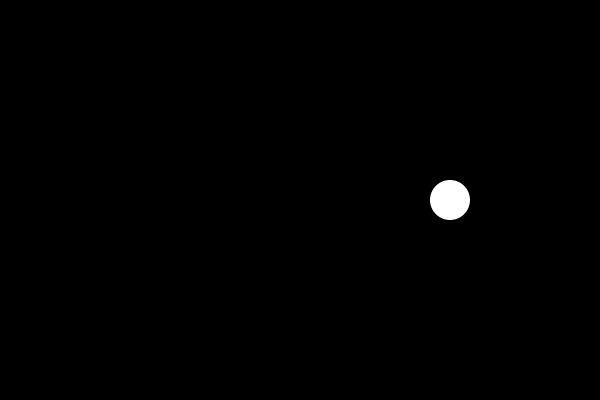
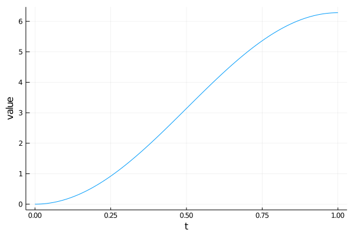
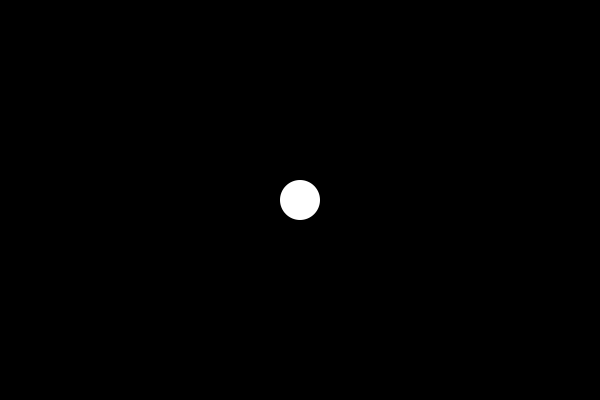
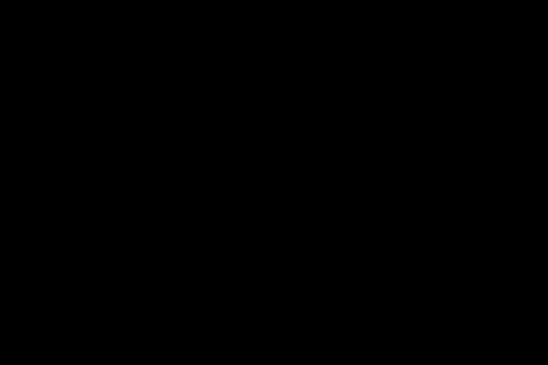

# **Tutorial 6:** Using Animations.jl to Create something with more Pep!

In the last couple of tutorials you've learned the basics of Javis and some of the more advanced stuff like [`SubAction`](@ref).

## Our goal

The goal of this tutorial is to explain a new feature we have added in v0.2 of Javis. Before this every animation was basically linear.
What I mean by this is: If you move an object from `A` to `B` using [`Translation`](@ref) it would do so in a linear and therefore boring fashion.

We'll create an interesting loading animation for this. It consists of five circles which move from the center to the outside rotate around the center and back to the origin. During this process they appear and disappear as well as changing color.

## Learning Outcomes

This tutorial shows some more power of subactions that we introduced in v0.2. Combined with the power of the awesome library [Animations.jl](https://github.com/jkrumbiegel/Animations.jl) you have very fine grained control over the objects you animate and understand the ease of its easing functions. 😄

Today you'll learn how to
- use easing functions to have animations with pep
- have full control over the animation of objects
- create a beautiful (if I can say so myself) loading animation

## Moving with Different Speed

The main point of this tutorial is to explain how to basically "interact" with objects with a non-linear speed. Our first step will be to rotate a circle around the origin at a increasing and then decreasing speed. 

Let's start with the boring linear animation:

```julia
using Javis

function ground(args...)
    background("black")
    sethue("white")
end

video = Video(600, 400)

actions = [
    Action(
        (args...) -> circle(Point(150, 0), 20, :fill);
        subactions = [
            SubAction(Rotation(0.0, 2π)),
        ],
    )
]

javis(
    video,
    [BackgroundAction(1:200, ground), actions...],
    pathname = "loading.gif",
)
```



I would say that this looks a bit dull. Let us rotate it with varying speeds. For this I'll use the `sineio` easing function. You can try another easing function.
They are all described [here](https://jkrumbiegel.github.io/Animations.jl/stable/#Easings-1).
Easing functions basically describe how to interpolate between the values. If one goes from `0` to `5` in the time range of `0` to `1`. It can be at `2.5` at `t=0.5` or it can start slowly and speed up until it reaches the final value of `5` such that at `t=0.5` it is only at let say `1.5`. 
This way one can describe the speed/acceleration of the object.

First of all we need `Animations` for this and I also load `Colors` here for later.

These can be installed via `] add Animations, Colors` inside the REPL.

```julia
using Javis, Animations, Colors

function ground(args...)
    background("black")
    sethue("white")
end

rotate_anim = Animation(
    [0, 1], # must go from 0 to 1
    [0, 2π],
    [sineio()],
)

video = Video(600, 400)

actions = [
    Action(
        (args...) -> circle(Point(150, 0), 20, :fill);
        subactions = [
            SubAction(rotate_anim, rotate()),
        ],
    )
]

javis(
    video,
    [BackgroundAction(1:200, ground), actions...],
    pathname = "loading.gif",
)
```


I think that looks more interesting. The [Animations.jl](https://jkrumbiegel.github.io/Animations.jl/stable) package is very powerful so you might wanna head over to their documentation and try different things.

Nevertheless, let me explain this part a bit and you can check out the documentation for more details.

```
rotate_anim = Animation(
    [0, 1], # must go from 0 to 1
    [0, 2π],
    [sineio()],
)
```

The `Animation` function takes in three arguments which are all vectors. 
1. Describe the time stamps. They should always go from `0` to `1` inside Javis.
2. The values at the different time stamps. Here we start at 0 radians and end with 2π radians.
3. The easing functions describe how to move from one value to the next. It must be always one less than the number of time stamps/values

We can actually have a look at this in a graphical plot:

```julia
using Animations
using Plots

rotate_anim = Animations.Animation(
    [0, 1], # must go from 0 to 1
    [0, 2π],
    [sineio()],
)

ts = 0:0.01:1
ys = at.(rotate_anim, ts)

plot(ts, ys; labels=false, xaxis="t", yaxis="value")
```




## Precise Movement

Okay we now know how to rotate with a different speed but let's do what we actually wanted. Moving out from the center, rotate and then move back to the center.
The code gets a bit longer from time to time so I'll only add changes from now on in the following way.
If I add something called `_anim` you can put it directly after `rotate_anim`. I'll otherwise only change the `actions` array.

Our new animations:

One translating from the origin to the right 

```julia
translate_anim = Animation(
    [0, 1], # must go from 0 to 1
    [O, Point(150, 0)],
    [sineio()],
)
```

and one translating back. One needs to make sure that it always starts at the origin (the current origin of the already translated view) to not introduce a break in the animation. More about that later.

```julia
translate_back_anim = Animation(
    [0, 1], # must go from 0 to 1
    [O, Point(-150, 0)],
    [sineio()],
)
```

and our `actions` (yes it's still a single [`Action`](@ref) but we add more soon)

```julia
actions = [
    Action(
        (args...) -> circle(O, 20, :fill);
        subactions = [
            SubAction(1:50, translate_anim, translate()),
            SubAction(51:150, rotate_anim, rotate_around(Point(-150, 0))),
            SubAction(151:200, translate_back_anim, translate()),
        ],
    )
]
```

I changed the starting position of the circle to `O` and we now have three subactions.

Let's walk through the steps Javis takes to create the animation:
- For the first 50 frames of the action the circle is translated from `O` to `(150, 0)` so just to the right. 
  - Remember the `O` is the same as `(0, 0)` and is at the center of the canvas at the beginning.
  - Then the circle is at position `(150, 0)`. Remember that it is still drawn at the origin so actually we shifted our whole view to the right.
- Therefore for the next 100 frames we need to specify that we actually want to rotate around the world origin which is at `Point(-150, 0)` from our current perspective. 
- Afterwards we are now again ath `(150, 0)` but see it as our origin and therefore need to move our circle to the left to `Point(-150, 0)` which is the world origin. 

Hope that makes sense! Let's see it in action:



## Adding more Blobs!

The blob does start to feel lonely a bit so let's give him some friends. They should all do the same movement but start at different times.

```julia
actions = [
    Action(
        frame_start:frame_start+149,
        (args...) -> circle(O, 20, :fill);
        subactions = [
            SubAction(1:30, translate_anim, translate()),
            SubAction(31:120, rotate_anim, rotate_around(Point(-150, 0))),
            SubAction(121:150, translate_back_anim, translate()),
        ],
    ) for frame_start in 1:10:50
]
```

I've basically added four more blobs by using `for frame_start in 1:10:50` inside the array definition. It's a basic list comprehension which might be hard to get at first as it's spreading over several lines. 

Then I defined the start of the `Action` with: `frame_start:frame_start+149` such that every blob is there for 150 frames and reduced the number of frames in the subactions a bit to have 150 frames.


## How about Color?

Okay everything is dull when we only use white and black. Let's make it such that our blobs change color from red over cyan to black which also make them disappear.

```julia
color_anim = Animation(
    [0, 0.5, 1], # must go from 0 to 1
    [Lab(colorant"red"), Lab(colorant"cyan"), Lab(colorant"black")],
    [sineio(), sineio()],
)
```

This time we actually have not only a start and end point of our animation but a point in between. We therefore have three timestamps `0.0` , `0.5` and `1.0`.
Our three colors red, cyan and black. You can play with different colors and color spaces if you want. 
And we need two easing functions: One defines the movement from red to cyan and the second from cyan to black.

```julia
actions = [
    Action(
        frame_start:frame_start+149,
        (args...) -> circle(O, 20, :fill);
        subactions = [
            SubAction(1:30, translate_anim, translate()),
            SubAction(31:120, rotate_anim, rotate_around(Point(-150, 0))),
            SubAction(121:150, translate_back_anim, translate()),
            SubAction(1:150, color_anim, sethue()),
        ],
    ) for frame_start in 1:10:50
]
```

The change in color is over the entire action in this case.


I think that already looks quite nice. The appearance of the blobs is a bit off though. How about fading them in by scaling them up?

```julia
actions = [
    Action(
        frame_start:frame_start+149,
        (args...) -> circle(O, 20, :fill);
        subactions = [
            SubAction(1:10, sineio(), appear(:scale)),
            SubAction(11:40, translate_anim, translate()),
            SubAction(41:120, rotate_anim, rotate_around(Point(-150, 0))),
            SubAction(121:150, translate_back_anim, translate()),
            SubAction(1:150, color_anim, sethue()),
        ],
    ) for frame_start in 1:10:50
]
```

A deeper look into the line we added?
```julia
SubAction(1:10, sineio(), appear(:scale)),
```

If we want to animate from `0` to `1` we don't need to write an `Animation` object for this and can simply specify the easing function. 
Additionally we use the `appear(:scale)` which does the same thing as:

```julia
SubAction(1:10, sineio(), scale()),
```

but it might be easier to read when we attach the meaning of `appear` to it.

Maybe have a look at [`appear`](@ref) and [`disappear`](@ref).



## Conclusion

To recap, by working through this animation you should now:

1. Understand how to make objects move in a non-linear way using Animations.jl
2. Be able to scale, translate, rotate objects in a finer control
3. Have fun with colors!

## The Code

```julia
using Javis, Animations, Colors

function ground(args...)
    background("black")
    sethue("white")
end

rotate_anim = Animation(
    [0, 1], # must go from 0 to 1
    [0, 2π],
    [sineio()],
)

translate_anim = Animation(
    [0, 1], # must go from 0 to 1
    [O, Point(150, 0)],
    [sineio()],
)

translate_back_anim = Animation(
    [0, 1], # must go from 0 to 1
    [O, Point(-150, 0)],
    [sineio()],
)

color_anim = Animation(
    [0, 0.5, 1], # must go from 0 to 1
    [Lab(colorant"red"), Lab(colorant"cyan"), Lab(colorant"black")],
    [sineio(), sineio()],
)

video = Video(600, 400)

actions = [
    Action(
        frame_start:frame_start+149,
        (args...) -> circle(O, 20, :fill);
        subactions = [
            SubAction(1:10, sineio(), appear(:scale)),
            SubAction(11:40, translate_anim, translate()),
            SubAction(41:120, rotate_anim, rotate_around(Point(-150, 0))),
            SubAction(121:150, translate_back_anim, translate()),
            SubAction(1:150, color_anim, sethue()),
        ],
    ) for frame_start in 1:10:50
]

javis(
    video,
    [BackgroundAction(1:200, ground), actions...],
    pathname = "loading.gif",
)
```

> **Author(s):** Ole Kröger \
> **Date:** September 10th, 2020 \
> **Tag(s):** loading, subactions, Animations.jl