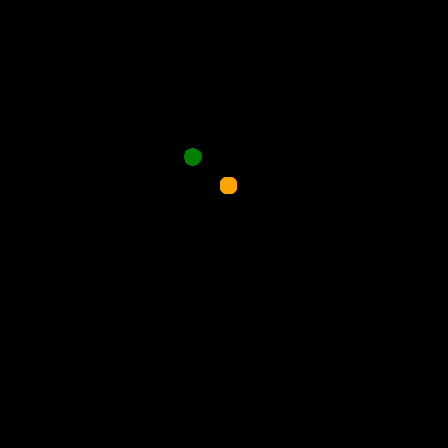

# **Tutorial 8:** Fun with Layers! An Intro to `@JLayer`

So far, we have been using `Javis` to create one animation at a time.
This has been great and you should be proud of your `Javis` skills so far!
However, what if I told you, there is a way to make multiple animations in one animation? 😎

And the way to do that?
Layers - specifically, `@JLayer`'s!

## What Even Are Layers? And What's a `@Jlayer`?

A layer is a common concept used in several animation toolkits and image editing softwares. Its goal is to make
it easy to divide an animation in different parts and work on each separately while the software takes care 
of the interactions between them, making it easier to put together complex videos or images composed of 
several simpler parts.

In `Javis` a `@JLayer` is the implementation of this idea, it allows you to enclose the content of an animation 
and to work on it, specifically `act!` on it, just like on a single `Object`, this way we don't need to care
for the interactions among different parts of a video, by acting on all of them one by one, but instead we can let 
`Javis` do all the annoying composition parts.

## Going Back to the Basics

In [Tutorial 1](tutorial_1.md), we learned how to make circles go around:


For this tutorial, we are going to reuse this animation but create an artistic animation similar to the works of famous American pop artist, Andy Warhol - here is an example:

http://www.mrspicassosartroom.com/2012/05/andy-warhol-color-theory-animals.html

### Let's Add Some Color!

First let us adjust the dancing circles animation to allow for color tweaking. As usual we start with all
the functions we already defined in [Tutorial 1](tutorial_1.md):

```julia
using Javis

# Different from tutorial one now background in black and pen is white
function ground(args...)
    background("black") # canvas background
    sethue("white") # pen color
end

function object(p=O, color="black")
    sethue(color)
    circle(p, 25, :fill)
    return p
end

function path!(points, pos, color)
    sethue(color)
    push!(points, pos) # add pos to points
    circle.(points, 2, :fill) # draws a circle for each point using broadcasting
end
```

Now let's add small changes to the dancing circles to make it into a function and add arguments to choose the 
colors of the two circles each time.

```julia

function dancing_circles(c1, c2, start_pos=O)
    path_of_red = Point[]
    path_of_blue = Point[]

    red_ball = Object((args...)->object(O, c1), start_pos + (100, 0))
    act!(red_ball, Action(anim_rotate_around(2π, start_pos)))
    blue_ball = Object((args...)->object(O, c2), start_pos + (200, 80))
    act!(blue_ball, Action(anim_rotate_around(2π, 0.0, red_ball)))
    Object((args...)->path!(path_of_red, pos(red_ball), c1))
    Object((args...)->path!(path_of_blue, pos(blue_ball), c2))
end
```

Now we have all the ingredients for a colored animation where we switched the color of the moving circles.

```julia
colored_planets = Video(500, 500)

Background(1:70, ground)

dancing_circles("green", "orange")

render(colored_planets, pathname="colored_planets.gif")
```
This will result in the same animation but different circles' colors and different background,
black has become more hyp since [Tutorial 1](tutorial_1.md)!!


### Moving Our Animation with Layers

We can now use layers to move around our previous animation. First we wrap it in a `@JLayer` macro.

```julia
myvideo = Video(500, 500)

Background(1:140, ground)

l1 = @JLayer 1:140 begin
    dancing_circles("green", "orange")
end

```
Then we `act!` on it just like on a regular Object.

```julia
act!(l1, Action(1:1, anim_scale(0.4)))
	
animation_point = Point(-75, -75)
anim_back_and_forth = Animation(
		[0, 1/2, 1],
		[animation_point, -animation_point, animation_point],
		[sineio(), sineio()]
	)
	
act!(l1, Action(1:140, anim_back_and_forth, translate()))

render(myvideo; pathname="dancing_circles_layer.gif")
```

This lets you move the dancing circles animation around the video without any effort!!



## Organizing Our Creation

### Positioning Our Layers

Now we try to use this idea to compose several layers in a single video, in particular we will move 4 groups of dancing circles to create an Andy Wharol style ensemble of dancing circles!!

First we pick the colors and some anchor points to reach when starting from the origin:

```julia
colors = [
    ["red", "green"],
    ["orange", "blue"],
    ["yellow", "purple"],
    ["greenyellow", "darkgoldenrod1"]
]

final_points = [
    Point(-150, -150),
    Point(150, -150),
    Point(150, 150),
    Point(-150, 150),
]
```

Then we start the video and define our circles:

```julia
myvideo = Video(500, 500)

Background(1:140, ground)

all_dancing_circles = map(colors) do c
    @JLayer 1:140 begin
        dancing_circles(c...) 
    end
end
```

We build the animation just like before but with different endpoints for each dancing 
circle we created and then we apply it to each layer together with a scaling action so we don't make the video
overly crowded. Finally we render it.

```julia 
anim_back_and_forth = map(planets) do point
    Animation(
        [0.0, 1/2, 1.0],
        [O, point, O],
        [sineio(), sineio()]
    )
end

map(zip(anim_back_and_forth, planets)) do (animation, pl)
    
    # Scale the layers
    act!(pl, Action(1:1, anim_scale(0.4)))

    # Move them around
    act!(pl, Action(1:140, animation, translate()))
end

render(myvideo; pathname="tutorial_8.gif")
```


### They're Multiplying!


## Conclusion

To wrap up, what this tutorial should help understand is how we can use `Layer`s to compose different
ideas created with `Javis` and join all of them without needing to move each part as a single one with lots of
`Action`s around. Indeed, we should first wrap several `Object`s, each with its `Action`s within a `@JLayer` and work
on it as a whole. This adds a new level of composability over the already flexible `Javis` allowing a whole new 
level of flexibility in animations!!

## Full Code

```julia
using Javis
using Animations

function ground(args...)
    background("black") # canvas background
    sethue("white") # pen color
end

function object(p=O, color="black")
    sethue(color)
    circle(p, 25, :fill)
    return p
end

function path!(points, pos, color)
    sethue(color)
    push!(points, pos) # add pos to points
    circle.(points, 2, :fill) # draws a circle for each point using broadcasting
end

function dancing_circles(c1, c2, start_pos=O)
    path_of_red = Point[]
    path_of_blue = Point[]

    red_ball = Object((args...)->object(O, c1), start_pos + (100, 0))
    act!(red_ball, Action(anim_rotate_around(2π, start_pos)))
    blue_ball = Object((args...)->object(O, c2), start_pos + (200, 80))
    act!(blue_ball, Action(anim_rotate_around(2π, 0.0, red_ball)))
    Object((args...)->path!(path_of_red, pos(red_ball), c1))
    Object((args...)->path!(path_of_blue, pos(blue_ball), c2))
end

finalvideo = Video(500, 500)

Background(1:140, ground)

colors = [
    ["red", "green"],
    ["orange", "blue"],
    ["yellow", "purple"],
    ["greenyellow", "darkgoldenrod1"]
]

final_points = [
    Point(-150, -150),
    Point(150, -150),
    Point(150, 150),
    Point(-150, 150),
]

planets = map(colors) do c
    @JLayer 1:140 begin
        dancing_circles(c...) 
    end
end

anim_back_and_forth = map(planets) do point
    Animation(
        [0.0, 1/2, 1.0],
        [O, point, O],
        [sineio(), sineio()]
    )
end

map(zip(anim_back_and_forth, planets)) do (animation, pl)
    act!(pl, Action(1:1, anim_scale(0.4)))
    act!(pl, Action(1:140, animation, translate()))
end

render(finalvideo; pathname="tutoral_8.gif")
```