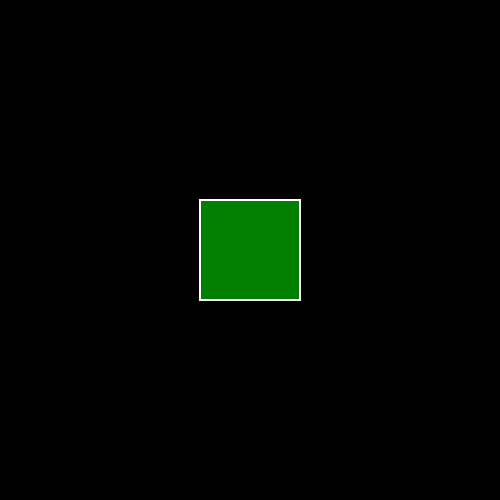

# **Tutorial 9:** Morphing `Javis` Objects   
<!-- TODO test all examples once more and update if they dont work -->
There are multiple ways to morph an object in Javis.

- Using the older `morph_to(::Function)` method. Very nice at matching the shapes for morphing . Has limitations on what the morphing function should contain.
- Using (New) `morph_to(::Object)` method. Any Object can be morphed to any other object using this method.
- Using `morph_to_fn(::Function)` method. Similar to `morph_to(::Object)` but morphs to a function instead. Can morph an object to a function that contains Luxor calls to draw what it should morphed into.
- Specifying an Action with an  `Animation` along with `morph()` to make keyframed morphings.

This tutorial will focus on the last three.

## Morphing one object to another.

Like other animations `morph_to(::Object)` is to be used with action. To learn more about Actions refer to [Tutorial 5](tutorial_5.md)
Here is a simple code snippet on how to use `morph_to`
```julia
using Javis

video = Video(500,500)
nframes = 160 

function circdraw(color)
    sethue(color)
    setopacity(0.5)
    circle(O,100,:fillpreserve)
    setopacity(1.0)
    sethue("white")
    strokepath()
end

function boxdraw(color)
    sethue(color)
    box(O,100,100,:fillpreserve)
    setopacity(1.0)
    sethue("white")
    strokepath()
end
Background(1:nframes,(args...)->background("black"))
circobj = Object((v,o,f) -> circdraw("red"))
boxobj  = Object((v,o,f) -> boxdraw("green"))

transform_to_box = Action(20:nframes-20, morph_to(boxobj))
act!(circobj, transform_to_box)
render(video,pathname="circ_to_box.gif")
```


If you aren't familiar with this syntax `(v,o,f)-> circdraw("red")` its an "anonymous" function or sometimes called a lambda function.
Basically a nameless function that is written on the spot in that line of code . One might as well use any other function `func` in place of it
(which takes at least 3 arguments `video,object,frame`). Elsewhere in the docs/tutorials you will come across
something of the form `Object( (args...) -> ("some code here") )`. This is [slurping](https://docs.julialang.org/en/v1/manual/faq/#The-two-uses-of-the-...-operator:-slurping-and-splatting) and is similar to packing `*args` in python. 

We created two objects `circobj` and `boxobj` . `circobj` ofcourse is a circle because its drawing function `(v,o,f) -> circdraw("red")`
draws a circle with a `color=red` filling at `0.5` opacity and then makes a white outline (stroke). 
`boxobj`'s function draws an opaque green box, with white outline.

This Object function is called repeatedly at render-time at every frame that the object exists to draw this object. The appropriate `video`,`object`, and `frame` are passed to
this function at render time.
Javis then has other tricks up its sleeve to scale/move/morph whats going to be drawn depending on the
frame and object to effect out animations through Actions. This is roughly the idea behind Javis's Object-Action mechanism

We defined a `transform_to_box` Action which runs from frame 20 from beginning to 20 frames from the end. The `Action` morphs whatever object its acted upon, into what looks
like `boxobj`. Note that `boxobj` and `circobj` are separate objects all the time, even after the `Action` (it just happens that they overlap each other). As the Action is applied at render time the "drawing" of `circobj` starts to look like `boxobj`'s drawing.

The Action is then applied to the `circobj` with the `act!` function.

Note that the `boxobj` is present throughout as the `circobj` is morphing.
If you want to hide it you can set its opacity to 0 with another action (to make it disappear) and set its frames to be drawn for 1 frame only (for efficiency).
```julia
Background(1:nframes,(args...)->background("black"))
boxobj = Object(1:1 , (args...) -> boxdraw("green") )
circobj = Object(1:nframes,(args...) -> circdraw("red"))

transform_to_box = Action(20:nframes-20, morph_to(boxobj))
hide_action = Action(1:1, (args...)->setopacity(0.0) )

act!(circobj, transform_to_box)
act!(boxobj, hide_action)

render(video,pathname="circ_to_box_hidden.gif")
```

However you can directly specify a shape an object has to morph to without making an Object using `morph_to_fn`.

## Morphing an `Object` using a `Function`  

```julia
Background(1:nframes,(args...)->background("black"))
#boxobj = Object(1:1 , (args...) -> boxdraw("green") )
circobj = Object(1:nframes,(args...) -> circdraw("red"))

transform_to_box = Action(20:nframes-20, morph_to_fn(boxdraw,["blue"]))
#hide_action = Action(1:1, (args...)->setopacity(0.0) )

act!(circobj, transform_to_box)
#act!(boxobj, hide_action)

render(video,pathname="circ_to_box_hidden.gif")
```


Here we have morphed  the circle  without defining an object to morph to. Rather the shape it has to morph into
is given by a `Function`.
The general syntax is `morph_to_fn(fn::Function,args::Array)`
. `args` is an array of arguments that is to be passed to the function.
Here we morph `circobj` to a shape 
that would is  drawn by `boxdraw("blue")`.

## Keyframed morphs using Animations.jl

Another mechanism for morphing is by passing `morph()` to `Action` along with an `Animation`
For a tutorial on how to use Animations.jl look at [Tutorial 7](tutorial_7.md),

```julia
using Javis
using Animations
video = Video(500,500)
nframes = 160 

function circdraw(color)
    sethue(color)
    setopacity(0.5)
    circle(O,50,:fillpreserve)
    setopacity(1.0)
    sethue("white")
    strokepath()
    line(O,O+10,:stroke)
end

function boxdraw(color)
    sethue(color)
    box(O,100,100,:fillpreserve)
    setopacity(1.0)
    sethue("white")
    strokepath()
end

function stardraw()
    sethue("white")
    star(O,100,5,0.5,0.0,:stroke)
end

Background(1:nframes+10,(args...)->background("black"))
boxobj = Object(1:nframes+10 , (args...) -> boxdraw("green") )

anim = Animation([0,1],MorphFunction[(boxdraw,["green"]),(circdraw,["red"])] )

action = Action(1:nframes,anim,morph())
act!(boxobj,action)
render(video,tempdirectory="images",pathname="circ_to_box_hidden.gif")
```

Take a look at `anim`. It is of type `Animation`. The first argument is a `Array` which describes
a set of keyframes . This `Array` should always start at 0 and end at 1 (can have numbers in between though as we will see in another example).
The second argument is an `Array` of `MorphFunction` .
`MorphFunction` is a struct . This struct has 2 fields (that are relevant to the end user).The fields are `func` and `args`.
For easier construction of Arrays of `MorphFunction`, one can pass `Tuples` of `func` and `args`.
For example `MorphFunction[ (f1,args1) , (f2,args2) ]` becomes `[ MorphFunction(f1,args1) , MorphFunction(f2,args2) ]`

The `Array` of `MorphFunction` passed to the `Animation`  defines a sequence of shapes/drawings that the `Object` should be morphed into one by one in that order. Each shape/drawing is what would have been got by calling `func(args...)` of the respective `MorphFunction`. In the example above there are only two in shapes in the sequence a green box and a red circle.Typically the first `MorphFunction` should draw the same thing that `Object` is.  

Thus we have made an  `Animation`  called `anim`. We can now make an `action` with this `anim`. Here we have called it `action` . Then we apply the action on our object `boxobj` to get ... 



Lets look at another example taking object to morph box(initial shape) -> star -> circle in a sequence.

Change the lines describing the animation to 
```julia
anim = Animation([0, 0.7, 1],MorphFunction[(boxdraw, ["green"]), (stardraw, []), (circdraw, ["red"])])
```
`stardraw` draws a white star without fill. The function does not take an argument and therefore the `Tuple` with `stardraw` should  have an empty `Array` at its
second index. If your drawing functions do not take any arguments you can pass it as function itself, and need not wrap it in a `Tuple`.

Ex. suppose `mydraw1` , `mydraw2` and  `mydraw4` take a color as an argument but `mydraw3` does not take any arguments.

```julia
anim = Animation([0, t1, t2, 1],MorphFunction[ (mydraw1,["red"]), (mydraw2,["blue"]), mydraw3, (mydraw4,["black"]) ])
```

<!-- Do not mix `Tuples{Function,Array}` and  `Function`s in the though, your array can have only one type -->


What we see now is from the beginning to 0.7 fraction of the `Action`'s frames it carries
out the morphing from a `boxdraw("green")` to `stardraw()`. 
And the remainder of the `Action`'s frames it morphs from `stardraw()` to `circdraw("red")`. Look up Animations.jl and Tutorial 7 to see how you pass easing functions to manipulate the timing of animations (for example ... initially slow - fast in the middle - slow in the end) . 
Now you know a bit about Morphing . Remember just like any other Action you can stack morphing actions with other Actions (translations, scaling etc) to bring about effects you desire. 

> **Author(s):** John George Francis (@arbitrandomuser) 
> **Date:** May 28th, 2022 \
> **Tag(s):** action, morphing, object, animation
