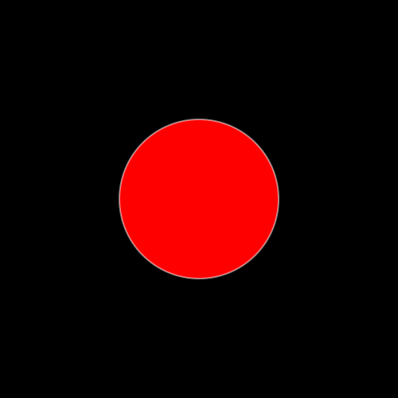

# **Tutorial 9:** Morphing `Javis` Objects   

There are multiple ways to morph an object in Javis.

- Using the older `morph_to(::Function)` method. Very nice at matching the shapes for morphing . Has limitations on what the morphing function should contain.
- Using (New) `morph_to(::Object)` method. Any Object can be morphed to any other object using this method.
- Using `morph_to_fn(::Function)` method. Similar to `morph_to(::Object)` but morphs to function instead. Can morph an object to a function that contains Luxor calls to draw what it should morphed into.
- Specifying an Action with interpolating Animation along with `morph()`

This tutorial will focus on the last three.

## Morphing one object to another.

Like other animations `morph_to(::Object)` is to be used with action. To learn more about Actions refer to [Tutorial 5](tutorial_5.md)
Here is a simple code snippet on how to use `morph_to`
```julia
using Javis

video = Video(500,500)
nframes = 160 

function circdraw(colo)
    sethue(colo)
    setopacity(0.5)
    circle(O,100,:fillpreserve)
    setopacity(1.0)
    sethue("white")
    strokepath()
end

function boxdraw(colo)
    sethue(colo)
    box(O,100,100,:fillpreserve)
    setopacity(1.0)
    sethue("white")
    strokepath()
end
Background(1:nframes,(args...)->background("black"))
circobj = Object((v,o,f) -> circdraw("red"))
boxobj  = Object((v,o,f) -> boxdraw("green"))

transform_to_box = Action(20:nframes-20, morph_to(boxobj))
act!(circobj, transform_to_box)
render(video,pathname="circ_to_box.gif")
```



if you aren't familiar with this syntax `(v,o,f)-> circdraw("red")` its an "anonymous" function or sometimes called a lambda function.
Basically a nameless function that is written on the spot in that line of code . One might aswell use any other function `func` in place of it
(which takes atleast 3 arguments `v,o,f`). Elsewhere in the docs/tutorials you will come across
something of the form `Object( (args...) -> (some;code;here) )`. This is [splatting](https://docs.julialang.org/en/v1/manual/faq/#The-two-uses-of-the-...-operator:-slurping-and-splatting) and is similar to packing `*args` in python. 

We created two objects `circobj` and `boxobj` . `circobj` ofcourse is a circle because its drawing function `(v,o,f) -> circdraw("red")`
draws a circle with a `colo=red` filling at `0.5` opacity and then makes a white outline (stroke). 
`boxobj`'s function draws an opaque green box, with white outline.

This Object function is called repeatedly at render-time at every frame that the object exists to draw this object. The apropriate `video`,`object`, and `frame` are passed to
this function at render time.
Javis then has other tricks up its sleave to scale/move/morph whats going to be drawn depending on the
frame and object to effect out animations through Actions. This is roughly the idea behind Javis's Object-Action mechanism

We defined a `transform_to_box` Action which runs from frame 20 from beginning to 20 frames from the end. The Action morphs whatever object its acted upon into what looks
like `boxobj`. Note that `boxobj` and `circobj` are seperate objects all the time, even after the Action (it just happens that they overlap each other). As the Action is applied at render time the "drawing" of `circobj` starts to look like `boxobj`'s drawing.

The Action is then applied to the `circobj` with the `act!` function.

Note that the `boxobj` is present throughout as the `circobj` is morphing.
if you want to hide it you can set its opacity to 0 with another action (to make it disappear) and set its frames to be drawn for 1 frame only (for efficiency).
```julia
Background(1:nframes,(args...)->background("black"))
boxobj = Object(1:1 , (args...) -> boxdraw("green") )
circobj = Object(1:nframes,(args...) -> circdraw("red"))

transform_to_box = Action(20:nframes-20, morph_to(boxobj))
hide_action = Action(1:1, (args...)->setopacity(0.0) )

act!(circobj, transform_to_box)
act!(boxobj, hide_action)

render(video,pathname="circ_to_box_hidden.gif")
```

However you can directly specify a shape an object has to morph to without making an Object using `morph_to_fn`.

```julia
Background(1:nframes,(args...)->background("black"))
#boxobj = Object(1:1 , (args...) -> boxdraw("green") )
circobj = Object(1:nframes,(args...) -> circdraw("red"))

transform_to_box = Action(20:nframes-20, morph_to_fn(boxdraw,["blue"]))
#hide_action = Action(1:1, (args...)->setopacity(0.0) )

act!(circobj, transform_to_box)
#act!(boxobj, hide_action)

render(video,pathname="circ_to_box_hidden.gif")
```


Here we have morphed  the circle  without defining an object to morph to. Rather the shape it has to morph into
is given by a `Function`.
The general syntax is `morph_to_fn(fn::Function,args::Array)`
. `args` is an array of arguements that is to be passed to the function.
Here we morph `circobj` to a shape 
that would is  drawn by `boxdraw("blue")`.
