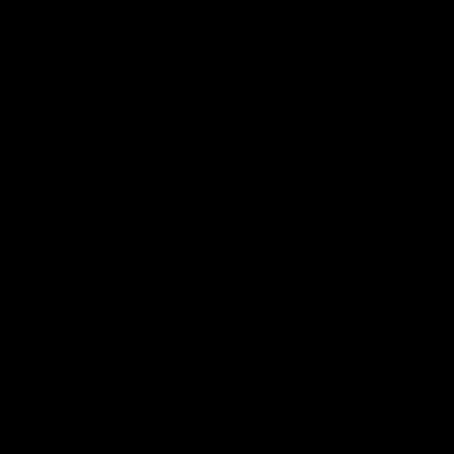
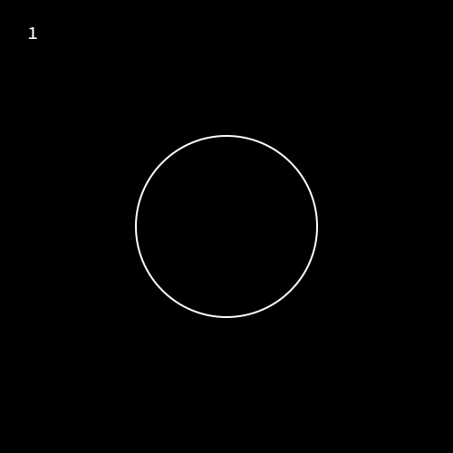
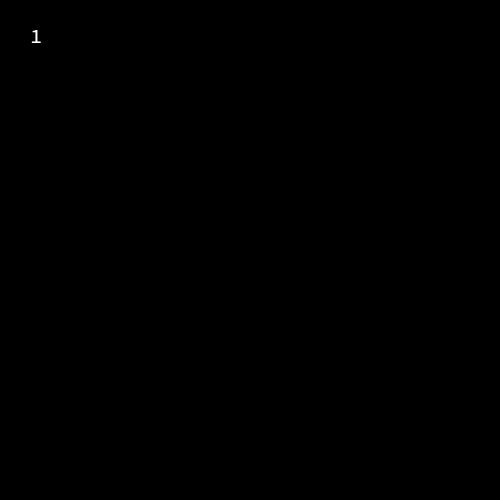

# **Tutorial 10:** Animating Creation of Objects

A cool effect of bringing in `Objects` into your video/gif is to show it being
drawn out incrementally from nothing. 



In this tutorial we'll take a look at how you can make these kind of animations


## The `showcreation` function 

The general syntax to animate the creation of an `object` is 

```julia
action = Action(startframe:endframe, showcreation() )
act!(obj, action)
```
 
This starts the creation of the object at `startframe` and the `object` is completely
drawn when the timeline reaches `endframe`.

lets see this in example.

```julia 
using Javis 
video = Video(500,500)

Background(1:120,(args...)->begin
								background("black")
								sethue("white")
							end)
circ = Object(1:120, (args...)-> circle(O,100,:stroke))

action_showcreate = Action(1:60,showcreation())
act!(circ,action_showcreate)

render(video,pathname="createcircle.gif")
```


You should see a circle being created in your video. ( I've added in the frame numbers
in the gif so that the beginning and end of the gif are easily identifiable ) 

What if we wanted to show the object being created at a later point in the timeline. Say
we want it to be created at frame 30 and finish at frame 90.
Thats simple! we change the frames that the Action works on . Change the line with `action_showcreate` in the above example to...

```julia
action_showcreate = Action(30:90, showcreation())
```



Oops! , Thats (probably) not what we wanted. (look at the frame numbers) . What happened was `obj` exists from frame 1 to 120. But the show creation acts on it from 30 to 90. So the object exists from frame 1 to 30 as it is . Then its creation is animated from 30 to 90 and from 90 to 120 it remains as such.

One way to mitigate this is to change the frames `obj` exists. Make this change in the code
above

```julia
circ = Object(30:120, (args...)->circle(O,100,:stroke))
```



Somethings still wrong!. One thing we forgot is the frames you mention in `Action` are 
the frames relative to the `Object`s existence. So what happened now is the object is put
on the scene from frame 30 onwards. The action acts on it from frame 30 relative to when
the object was put. So `30+30` i.e `60` is the frame at which `action` starts.
Can you fix this ? 

```julia
action_showcreate = Action(1:60,showcreation())
```


There we go ! It turned out we dont need to change the frames of the action, but the frames of the Object. 
Hopefully by intentionally showing you a wrong way to do it you understood the working of  `Actions` a little better.

Another way is to have the object present throughout the video and to "hide" it initially till it is to be shown, with an action
that sets the objects opacity to 0. 

There exists a similar function `showdestruction()` which does exactly the opposite of `showcreation()`.

> **Author(s):** John George Francis (@arbitrandomuser) 
> **Date:** May 28th, 2022 \
> **Tag(s):** action, morphing, object, animation
