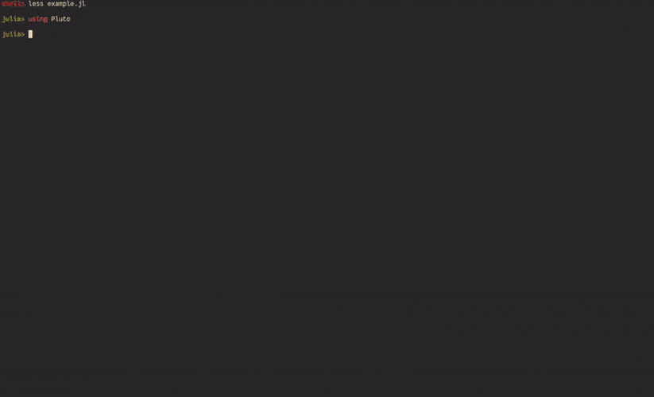
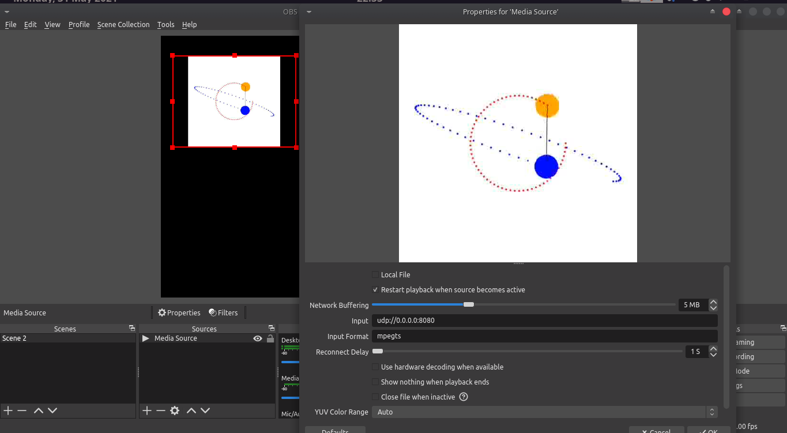

# Workflows for `Javis` Animation Development

`Javis` provides an easy way to create performant visualizations.
However, sometimes building these animations can be a difficult process with having to keep track of one's code, particular frames, and previewing your graphic.
This section is dedicated to workflows one can use for making `Javis` animations.

## Previewing Animations Using the Javis Live Viewer

Supported Platforms: Windows*, OSX, Linux

> NOTE: Windows users may experience a slow-down with the Javis Live Viewer. 
> This is because the viewer is built on top of GTK which is not immensely performant on Windows machines.
> If the viewer is does not perform well on Windows for you, we encourage you to try out one of the other workflows.

Javis provides a built-in viewer called the "Javis Live Viewer" which allows one to preview animated graphics without having to save the animation to a file.
This works by the viewer calculating each individual frame for an animation as it is called.
The viewer can be activated for any animation one renders by doing this:

```julia
...
render(video, liveview = true)
```

Setting `liveview` to true in the `render` function causes the Viewer to appear in a separate window.
Here is an example of how that looks altogether:


Sometimes the Viewer can be slow on some computers if it is handling a large animation or a frame performing complicated actions with many objects.
If this is the case, currently, the best way to handle this is to fully render the animation and save it to a file for previewing.
In the future, we will add a caching feature for the Viewer such that all frames are pre-rendered for the Viewer so one can quickly view each frame.

## Workflow for Jupyter Notebooks

Javis now supports a minimal version of the Javis viewer using the [Interact.jl](https://github.com/JuliaGizmos/Interact.jl) package. It automatically detects the `IJulia`(Jupyter Notebook environment).
Here's what it looks like with the `liveviewer` flag set to `true` :


> NOTE: For animations involving heavy computation this may be a bit laggy.

### Common Problems:
- WebIO error (WebIO is not installed)
    
    The comment in discussion [here](https://github.com/Wikunia/Javis.jl/pull/288#issuecomment-747671260) should help out with the problem.

- No change on dragging the silder/changing the value in textbox

    Try restarting the kernel. This might problably be an error with the WebIO integration.


To make the Jupyter Notebook experience with Javis more easy, videos rendered as gifs via setting the `liveview` flag as `false`, are directly viewed as `MIME` elements in the notebook as seen below: 


## Workflow for Pluto Notebooks :balloon:

**Supported Platforms:** Windows*, OSX, Linux

The workflow for Pluto notebooks is very similar to using Jupyter notebooks but with some crucial differences!
** PLEASE READ EACH OF SECTIONS CAREFULLY TO GET PLUTO NOTEBOOKS TO WORK WITH YOUR ANIMATIONS!**

### Install the Required Pluto Packages

You will need to use two packages:

- [**Pluto**](https://github.com/fonsp/Pluto.jl) - simple reactive notebooks for Julia

- [**PlutoUI**](https://github.com/fonsp/PlutoUI.jl) - enables the creation of widgets in Pluto notebooks

To install these packages, run the following in your Julia REPL:

```
] add Pluto, PlutoUI
```

### Example of Running a Pluto Notebook

Copy this following script into a Julia file (like, `example.jl`):

```julia
### A Pluto.jl notebook ###
# v0.14.5

using Markdown
using InteractiveUtils

# This Pluto notebook uses @bind for interactivity. When running this notebook outside of Pluto, the following 'mock version' of @bind gives bound variables a default value (instead of an error).
macro bind(def, element)
    quote
        local el = $(esc(element))
        global $(esc(def)) = Core.applicable(Base.get, el) ? Base.get(el) : missing
        el
    end
end

# ╔═╡ d6c62fb0-bb9d-11eb-33e0-f5de58261376
using PlutoUI, Javis

# ╔═╡ ff1ff714-bb9f-11eb-1dfa-fbfa8c75d19f
begin
    function ground(args...)
        background("white") # canvas background
        sethue("black") # pen color
    end

    function object(p = O, color = "black")
        sethue(color)
        circle(p, 25, :fill)
        return p
    end

    function path!(points, pos, color)
        sethue(color)
        push!(points, pos) # add pos to points
        circle.(points, 2, :fill) # draws a circle for each point using broadcasting
    end

    function connector(p1, p2, color)
        sethue(color)
        line(p1, p2, :stroke)
    end

    myvideo = Video(500, 500)

    path_of_red = Point[]
    path_of_blue = Point[]

    Background(1:70, ground)
    red_ball = Object(1:70, (args...) -> object(O, "red"), Point(100, 0))
    act!(red_ball, Action(anim_rotate_around(2π, O)))
    blue_ball = Object(1:70, (args...) -> object(O, "blue"), Point(200, 80))
    act!(blue_ball, Action(anim_rotate_around(2π, 0.0, red_ball)))
    Object(1:70, (args...) -> connector(pos(red_ball), pos(blue_ball), "black"))
    Object(1:70, (args...) -> path!(path_of_red, pos(red_ball), "red"))
    Object(1:70, (args...) -> path!(path_of_blue, pos(blue_ball), "blue"))

    mygif = render(myvideo; liveview = true)

end

# ╔═╡ fb96b6b6-bb9d-11eb-2861-5dcfbab3e6f1
@bind x Slider(1:1:70)

# ╔═╡ 2664d0b2-bb9e-11eb-1af0-8d1c96dd8c92
mygif[x]

# ╔═╡ Cell order:
# ╠═d6c62fb0-bb9d-11eb-33e0-f5de58261376
# ╠═ff1ff714-bb9f-11eb-1dfa-fbfa8c75d19f
# ╠═fb96b6b6-bb9d-11eb-2861-5dcfbab3e6f1
# ╠═2664d0b2-bb9e-11eb-1af0-8d1c96dd8c92
```

Then run the following commands in your Julia REPL:

```
using Pluto
Pluto.run()
```

Select the `example.jl` file from within the Pluto instance and you are good to go with running a Javis notebook!



### Notes When Running Javis in Pluto Notebooks

To generate a live view in general for an animation you are working on (with a slider), enter the two following statements into two separate cells (not inside a `begin`-`end` block):

```julia
# frames: number of frames
@bind x Slider(1:1:frames)

anim[x]
``` 

This will give you the ability to preview an animation with a slider:


If you don't want to use the interactivity and simply display the output, set the `liveviewer` flag as `false` in the Javis `render` function and Pluto will display the gif:


## Livestreaming animations
Javis brings in the support to pipe the rendered animations to streaming software(like OBS, VLC) or directly to platforms like Twitch or any alternatives that can read from a network stream.

- ### Streaming Locally
Many educational streamers/teachers prefer using streaming tools like OBS/VLC to have more creative control over their streams. Javis livestreaming is tuned for such use cases.
The animation can be streamed to a local IP/port and can be viewed using any tool that can read from a network stream.

Firstly, one needs to setup the `StreamConfig` object that holds configuration regarding the streaming process. Javis uses `udp://0.0.0.0:14015` as the default streaming protocol, address and port respectively. However you're free to use any options of your choice.

!!! warning
    
    While you can stream to any IP/port, we recommend using the default streaming protocol `udp` if you wish to share the stream with other people(connected over the network) or tools like OBS. 

```julia
...
stream_conf = setup_stream(:local)
render(vid, streamconfig=stream_conf)
```
Other use cases: If you wish to share an animation with a group of people connceted over the same network, you can start streaming and other people can access the stream using tools like VLC, ffplay, mplayer etc.

An example of how to setup things on the receiver's side: 

On OBS:


For tools like ffplay one can view the stream by typing `ffplay <protocol>://<address>:<port>`  in the terminal.

eg: `ffplay udp://127.0.0.1:8081`

- ### Streaming to Twitch
Javis allows streaming animations directly to the [Twitch](twitch.tv) platform.
All you need to do is pass the symbol `:twitch` and your [twitch stream key](https://www.businessinsider.in/tech/how-to/how-to-find-your-twitch-stream-key-which-will-let-you-start-streaming-games-and-access-other-features/articleshow/76450099.cms) as arguments to the `stream_setup` method.
```julia
...
stream_conf = setup_stream(:twitch, twitch_key = "<twitch stream key>")
render(vid, streamconfig=stream_conf)
```
