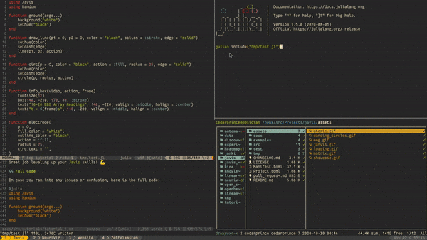

# Workflows for `Javis` Animation Development

`Javis` provides an easy way to create performant visualizations.
However, sometimes building these animations can be a difficult process with having to keep track of one's code, particular frames, and previewing your graphic.
This section is dedicated to workflows one can use for making `Javis` animations.

## Previewing Animations Using the Javis Live Viewer

Supported Platforms: Windows*, OSX, Linux

> NOTE: Windows users may experience a slow-down with the Javis Live Viewer. 
> This is because the viewer is built on top of GTK which is not immensely performant on Windows machines.
> If the viewer is does not perform well on Windows for you, we encourage you to try out one of the other workflows.

Javis provides a built-in viewer called the "Javis Live Viewer" which allows one to preview animated graphics without having to save the animation to a file.
This works by the viewer calculating each individual frame for an animation as it is called.
The viewer can be activated for any animation one renders by doing this:

```julia
...
render(video, liveview = true)
```

Setting `liveview` to true in the `render` function causes the Viewer to appear in a separate window.
Here is an example of how that looks altogether:



Sometimes the Viewer can be slow on some computers if it is handling a large animation or a frame performing complicated actions with many objects.
If this is the case, currently, the best way to handle this is to fully render the animation and save it to a file for previewing.
In the future, we will add a caching feature for the Viewer such that all frames are pre-rendered for the Viewer so one can quickly view each frame.

## Working with Pluto and Jupyter Notebooks 📓

`Javis` has the ability to work completely within [Jupyter](https://jupyter.org) and [Pluto](https://github.com/fonsp/Pluto.jl) notebooks!
It uses the package, [`JavisNB`](https://juliaanimators.github.io/JavisNB.jl/stable), within the JuliaAnimators ecosystem to enable very simple support for Jupyter and Pluto.
Please see the [documentation for JavisNB](https://juliaanimators.github.io/JavisNB.jl/stable) to learn how it works and to use it!

## Live Streaming

Javis supports directing animations to streaming software after rendering a visualization.

### Streaming Locally

Many professionals and streamers prefer using streaming tools, such as [OBS Studio](https://obsproject.com/) and [VLC Media Player](https://www.videolan.org/vlc/), to have more creative control over their lectures or streams.
Javis live streaming is tuned for such use cases.
The animation can be streamed to a local IP or port and be viewed using any tool that can read from a network stream.

Firstly, one needs to setup the `StreamConfig` object that holds configuration regarding the streaming process.
That is as simple as this one line of code in your animation script:

```julia
stream_conf = setup_stream(:local)
```

After that, you can render your animation to a network platform of your choice by editing the `render` command:

```julia
render(vid, streamconfig=stream_conf)
```

Javis uses `udp://0.0.0.0:14015` as the default streaming protocol, address and port respectively. 
However you're free to use any options of your choice.

> **NOTE:** While you can stream to any IP/port, we recommend using the default streaming protocol `udp` if you wish to share the stream with other people (connected over the network) or tools like OBS Studio. 

### Streaming to Local Networks

Javis also can be used to share an animation with a group of people connected over the same network.
One can start streaming and other people can access the stream 
To start a stream, it is the exact same process as a typical local stream:

```julia
stream_conf = setup_stream(:local)
render(vid, streamconfig=stream_conf)
```

From there, anyone can open up the stream and view it using a viewing tool of their choice.

### Tools for Viewing Live Streams

To view live streams generated from Javis, we recommend the following tools (although any tool that supports network streaming will do):
using tools like VLC, ffplay, mplayer etc.

1. [OBS Studio](https://obsproject.com/) - to view on OBS Studio, you will need to add a "Media Source" that defines the stream output from Javis.
To do that, make sure that the option for "Local File" is unchecked, and type in the location of the network stream that you have set (the default is: `udp://0.0.0.0:14015`) to "Input".
Finally, change the "Input Format" to `mpegts` and you should be set to view the rendering!

> **NOTE:** Currently, OBS Studio has an issue where once the stream is done, the last frame sent from Javis is kept on the screen.
You will have to manually turn off the source or hide it in the OBS Studio client.

2. [ffplay](https://ffmpeg.org/ffplay.html) - on a command line, one can view a stream by typing `ffplay <protocol>://<address>:<port>`.
Using the default, an example would be `ffplay udp://0.0.0.0:14015` for viewing a Javis rendering.

3. [VLC Media Player](https://www.videolan.org/vlc/) - to use VLC, go to "Media" and then to "Open Network Stream".
Finally after that, go to the "Network" tab and, per the Javis default, put `udp://@:14015` as the network URL and select "Play".

### Twitch Support - Coming Soon!

````@meta
### Streaming to Twitch


Javis allows streaming animations directly to the [Twitch](twitch.tv) platform.
All you need to do is pass the symbol `:twitch` and your [twitch stream key](https://www.businessinsider.in/tech/how-to/how-to-find-your-twitch-stream-key-which-will-let-you-start-streaming-games-and-access-other-features/articleshow/76450099.cms) as arguments to the `stream_setup` method.
```julia
...
stream_conf = setup_stream(:twitch, twitch_key = "<twitch stream key>")
render(vid, streamconfig=stream_conf)
```
````

